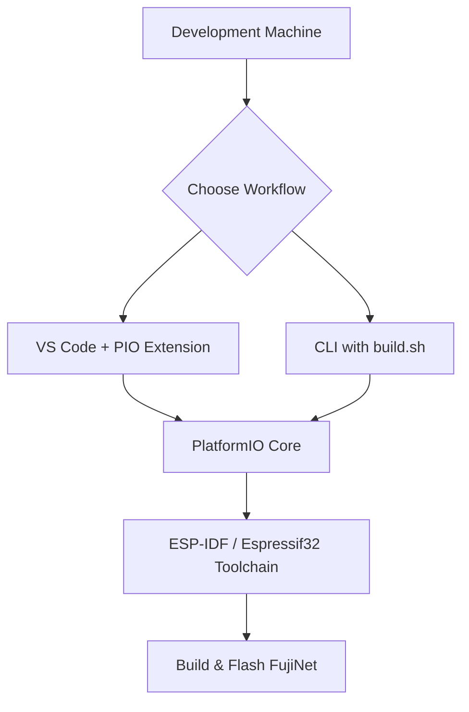

# Setting Up the Build Environment

This guide covers everything needed to prepare your development machine for building FujiNet firmware. Whether you plan to use an IDE or work entirely from the command line, these steps will get you up and running.

## Supported Operating Systems

| OS | Notes |
|---|---|
| Linux (Ubuntu, Debian, etc.) | Recommended. Native support. |
| macOS (Intel and Apple Silicon) | Fully supported. |
| Windows (via WSL) | Install WSL/WSL2 from the Microsoft Store. Building on raw Windows is not recommended. |

## Prerequisites

### System Packages (Linux / WSL)

Update your system and install the required packages:

```bash
sudo apt update && sudo apt upgrade
sudo apt install git curl python3-venv cmake build-essential \
    libmbedtls-dev libexpat1-dev pip -y
```

For [FujiNet-PC builds](./building_fujinet_pc.md), you will also need:

```bash
sudo apt install libpython3-dev
sudo pip install Jinja2
```

### USB Permissions (Linux / WSL)

To flash firmware over USB, your user account must be in the `dialout` group:

```bash
sudo adduser $(whoami) dialout
newgrp dialout
```

A reboot is required for the group change to take full effect.

### Python

PlatformIO requires Python 3. Most modern Linux and macOS systems ship with Python 3 already installed. Verify with:

```bash
python3 --version
```

## Installing PlatformIO Core (CLI)

PlatformIO (PIO) is the build system used for FujiNet firmware. It should always be installed in your home directory.

1. **Download the installer:**

   ```bash
   cd ~
   curl -fsSL -o get-platformio.py \
       https://raw.githubusercontent.com/platformio/platformio-core-installer/master/get-platformio.py
   ```

2. **Run the installer:**

   ```bash
   python3 ./get-platformio.py
   ```

3. **Add PIO to your PATH:**

   ```bash
   export PATH=$PATH:~/.platformio/penv/bin
   ```

   To make this permanent, add it to your shell profile:

   ```bash
   echo 'export PATH=$PATH:~/.platformio/penv/bin' >> ~/.bashrc
   ```

4. **Install the ESP32 platform:**

   ```bash
   pio platform install espressif32
   ```

## VS Code + PlatformIO IDE (Optional)

If you prefer a graphical IDE, Visual Studio Code with the PlatformIO extension provides an integrated experience:

1. Install [Visual Studio Code](https://code.visualstudio.com/).
2. Open the Extensions panel (`Ctrl+Shift+X`) and search for **PlatformIO IDE**.
3. Install the extension and restart VS Code.
4. PlatformIO will automatically detect the FujiNet project when you open the repository folder.

> **Note:** If you use both the CLI and VS Code, avoid running them simultaneously as there will be file contention between the two.

## Verifying the Installation

After installation, confirm PlatformIO is available:

```bash
pio --version
```

You should see output similar to:

```
PlatformIO Core, version 6.x.x
```

## Environment Overview



## Next Steps

- [Building Firmware](./building_firmware.md) -- clone the repository and compile firmware for your target platform.
- [Building FujiNet-PC](./building_fujinet_pc.md) -- build the desktop/POSIX version of FujiNet.
- [Firmware Versioning](./versioning.md) -- understand the version numbering scheme.
