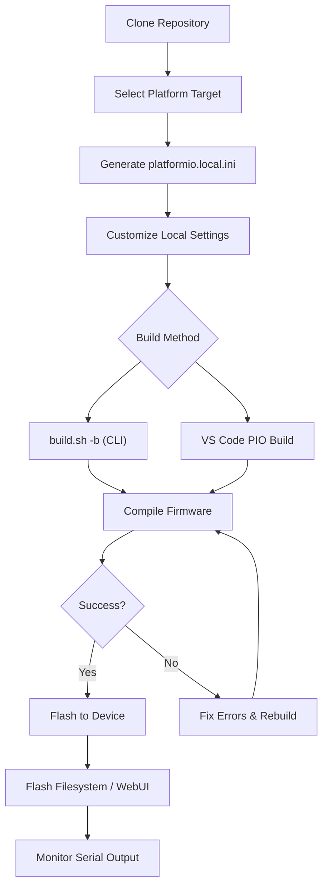

# Building FujiNet Firmware

This guide walks through cloning the FujiNet firmware repository, selecting a target platform, building the firmware, flashing it to hardware, and monitoring output. It assumes you have already completed the [build environment setup](./build_environment.md).

## Build Process Overview



## Cloning the Repository

### Clone vs. Fork

- **Clone directly** if you only want to build and use the firmware.
- **Fork first** if you plan to modify code and contribute changes via pull requests.

```bash
mkdir -p ~/code && cd ~/code
git clone https://github.com/FujiNetWIFI/fujinet-firmware.git
cd fujinet-firmware
```

## Selecting a Platform Target

The `build.sh` script manages platform configuration files so that multiple targets can coexist without interfering with each other.

### List Available Boards

Run `build.sh` without arguments to see all supported boards:

```bash
./build.sh
```

The output lists supported boards at the bottom. Current boards include:

| Board INI | Platform |
|---|---|
| `fujinet-atari-v1` | Atari 8-bit |
| `fujiapple-rev0` | Apple II |
| `fujinet-adam-v1` | Coleco ADAM |
| `fujinet-coco-lolin-d32-dw` | Tandy CoCo |
| `fujinet-v1-8mb` | FujiNet v1 (8MB flash) |
| `fujinet-iec-nugget` | Commodore IEC (Nugget) |
| `fujinet-cx16` | Commander X16 |
| `fujinet-heathkit-h89` | Heathkit H89 |
| `fujinet-lynx-prototype` | Atari Lynx |
| `fujinet-rc2014spi-rev0` | RC2014 SPI |
| `fujinet-rs232-rev0` | RS-232 |
| `fujinet-s100-v1-8mb` | S-100 Bus |

### Set Up a Board

Use the `-s` flag with the board name (drop the `platformio-` prefix and `.ini` suffix):

```bash
./build.sh -s fujinet-atari-v1
```

You will be prompted to confirm. This creates `platformio.local.ini` with the selected board configuration.

### Platform Configuration (platformio.local.ini)

After setup, you may need to edit `platformio.local.ini` to set your USB serial device:

- **Linux:** Typically `/dev/ttyUSB0` (the default).
- **macOS:** Something like `/dev/cu.usbserial-XXXXX`. Find it with:

  ```bash
  ls /dev/tty* | grep usb
  ```

- **WSL:** USB passthrough to WSL requires additional setup. See the [FujiNet USB-WSL video guide](https://youtu.be/iofdXz_x8wc).

> **Important:** Do not manually create `platformio.ini` using `pio project init`. Let `build.sh` handle configuration file generation.

## Using build.sh

The `build.sh` script is the primary build tool. Here is the full set of options:

```
Usage: build.sh [-b|-e ENV|-c|-m|-x|-t TARGET|-h]
   -b       # run build
   -c       # run clean before build
   -d       # add dev flag to build
   -m       # run monitor after build
   -u       # upload image (device code)
   -f       # upload filesystem (webUI etc)
   -x       # exclude dep graph output from logging
   -e ENV   # use specific environment
   -t TGT   # run target task
   -s NAME  # setup a new board
   -a       # build all platforms
   -h       # this help
```

### Common Build Commands

| Command | Description |
|---|---|
| `./build.sh -b` | Build firmware only (no flash). Good as a first test. |
| `./build.sh -um` | Build, flash firmware, and start serial monitor. |
| `./build.sh -fum` | Build, flash firmware + filesystem (WebUI), and monitor. |
| `./build.sh -cb` | Clean and rebuild from scratch. |
| `./build.sh -a` | Build all platforms. Results written to `build-results.txt`. |

### Build and Flash Example

A typical development cycle:

```bash
# Ensure PIO is in PATH
export PATH=$PATH:~/.platformio/penv/bin

# Build, flash, and monitor
./build.sh -um
```

PlatformIO detects changed files automatically and only recompiles what is necessary.

## Serial Monitor

You can monitor the FujiNet serial output independently of building:

```bash
pio device monitor -b 460800 -p /dev/ttyUSB0
```

Replace `/dev/ttyUSB0` with your actual device path. The baud rate for FujiNet is **460800**.

The serial monitor provides real-time debug output from the running firmware, which is invaluable during development.

## Build All Platforms

To verify that your changes compile across every supported platform:

```bash
./build.sh -a
```

This produces a `build-results.txt` file in the repository root with timestamps and success/failure status for each platform.

## Nightly Builds

Pre-built nightly firmware images from the `master` branch are available at:

<https://github.com/FujiNetWIFI/fujinet-firmware/releases/tag/nightly>

## Troubleshooting

| Problem | Solution |
|---|---|
| `NotPlatformIOProjectError` | Run `./build.sh -s <board>` to generate the INI file. Do not run `pio project init`. |
| USB device not found | Check your `platformio.local.ini` serial port setting. On Linux, ensure your user is in the `dialout` group. |
| Build contention errors | Do not run VS Code with PIO and `build.sh` simultaneously. Also avoid running FujiNet Flasher at the same time. |

## Next Steps

- [Building FujiNet-PC](./building_fujinet_pc.md) -- build the desktop version for use with emulators.
- [Firmware Versioning](./versioning.md) -- understand how version numbers are managed.
- [Build Environment Setup](./build_environment.md) -- revisit prerequisite installation.
