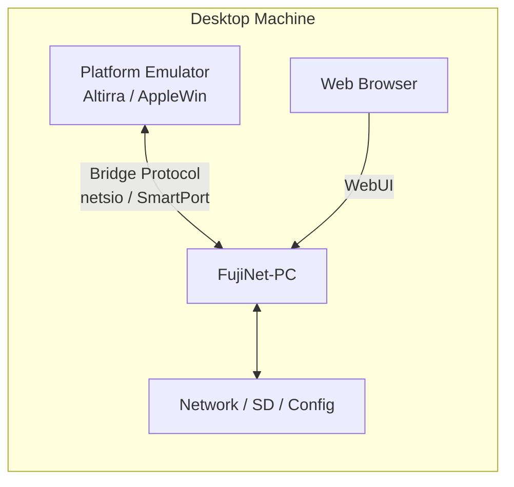
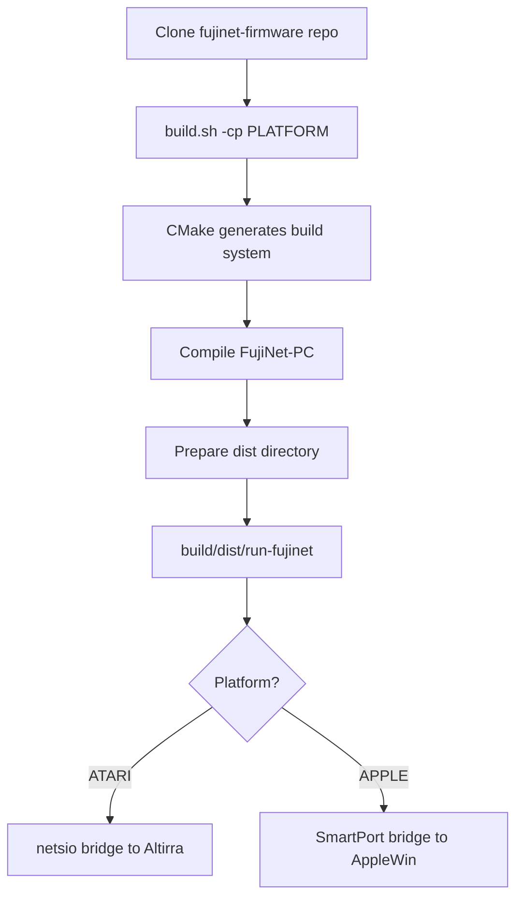

# Building FujiNet-PC

FujiNet-PC is the POSIX/desktop implementation of FujiNet. It runs on Linux, macOS, and Windows (via WSL), providing the full FujiNet experience without any hardware. Combined with a platform emulator such as Altirra (Atari) or AppleWin (Apple II), it creates a complete virtual retro computing environment.

As of 2024, the FujiNet-PC codebase is integrated into the main [fujinet-firmware](https://github.com/FujiNetWIFI/fujinet-firmware) repository. The same `build.sh` script handles both firmware and FujiNet-PC builds.

## Architecture Overview



## Dependencies

### Linux / WSL

Install the required packages:

```bash
sudo apt update && sudo apt upgrade
sudo apt install git curl build-essential cmake \
    libpython3-dev python3-venv libmbedtls-dev pip -y
sudo pip install Jinja2
```

### macOS

Ensure you have Xcode command line tools, CMake, and Python 3 installed:

```bash
xcode-select --install
brew install cmake python3 mbedtls
pip3 install Jinja2
```

## Building FujiNet-PC

FujiNet-PC is built using the `-p` flag with `build.sh`. You must specify the target platform (the retro computer being emulated).

### Build for Atari

```bash
cd ~/code/fujinet-firmware
./build.sh -cp ATARI
```

### Build for Apple II

```bash
./build.sh -cp APPLE
```

The `-c` flag triggers a clean build (recommended for the first build). Subsequent builds can omit it:

```bash
./build.sh -p ATARI
```

### Build Output

A successful build produces output similar to:

```
[100%] Built target fujinet
[100%] Preparing dist directory
[100%] Built target dist
Built PC version in build/dist folder
```

The compiled application and all required files are placed in the `build/dist` directory.

## Running FujiNet-PC

```bash
cd build/dist
./run-fujinet
```

You should see startup output like:

```
Starting FujiNet
14:46:46.292954 >
14:46:46.296816 > --~--~--~--
14:46:46.296857 > FujiNet v1.3 2024-04-26 06:08:28 Started
14:46:46.296910 > Detected Hardware Version: fujinet-pc
14:46:46.296944 > SPIFFS mounted.
14:46:46.298056 > SD mounted (directory "SD").
```

Once running, access the FujiNet WebUI by opening a browser to:

```
http://localhost:8000
```

## Using with Emulators

### Altirra (Atari)

FujiNet-PC for Atari uses the `netsio` bridge to connect to [Altirra](https://www.virtualdub.org/altirra.html). On Linux, Altirra runs via Wine.

1. Start FujiNet-PC (it listens for `netsio` connections automatically).
2. Launch Altirra.
3. In Altirra, configure the SIO device to use the network SIO bridge.

### AppleWin (Apple II)

FujiNet-PC for Apple II connects directly to [AppleWin](https://github.com/AppleWin/AppleWin) (a native Linux port is available).

1. Start FujiNet-PC for Apple.
2. Launch AppleWin.
3. Configure AppleWin to use the FujiNet SmartPort device.

## FujiNet Virtual Machine

For the easiest way to try FujiNet-PC without manual setup, a pre-built VirtualBox appliance is available. The [FujiNet Virtual Machine](https://vm.fujinet.online) includes:

- Debian 12 Linux with XFCE 4 desktop
- Altirra (via Wine) and AppleWin (native Linux port)
- FujiNet-PC pre-configured for both Atari and Apple II
- `netsio` bridge for Altirra connectivity
- Epiphany web browser for WebUI access

Download the VM appliance (~3.6 GB):
<https://mega.nz/folder/4L03hKRL#L1GOblpv8xbHROaKIPb1xg>

For detailed VM usage instructions, see the [official FujiNet VM documentation](https://fujinet-vm.readthedocs.io/).

## FujiNet-PC Build Process



## Troubleshooting

| Problem | Solution |
|---|---|
| Missing `cmake` or build tools | Install the full set of [dependencies](#dependencies) for your OS. |
| `Jinja2` module not found | Run `sudo pip install Jinja2`. |
| Cannot connect emulator to FujiNet-PC | Ensure FujiNet-PC is running before launching the emulator. Check that no firewall rules block localhost connections. |
| WSL USB passthrough issues | See the [USB-WSL video guide](https://youtu.be/iofdXz_x8wc) for setup instructions. |

## Next Steps

- [Build Environment Setup](./build_environment.md) -- prerequisite installation details.
- [Building Firmware](./building_firmware.md) -- building firmware for physical FujiNet hardware.
- [Firmware Versioning](./versioning.md) -- how FujiNet version numbers work.
