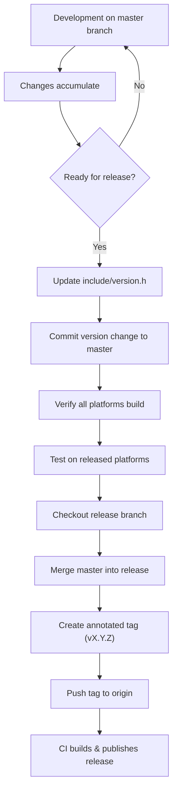

# Firmware Versioning

FujiNet uses a manual versioning scheme maintained by developers in the source code. This document describes the version format, when to change version numbers, and the process for creating a release build.

## Version Format

FujiNet firmware versions follow a three-part numeric format:

```
vMAJOR.MINOR.BUILD
```

For example: `v1.3.0`

| Component | Purpose | When to Increment |
|---|---|---|
| **MAJOR** | Significant architectural changes or breaking updates | Major rewrites, protocol changes, or backward-incompatible modifications |
| **MINOR** | New features or notable improvements | New device support, new protocol features, significant enhancements |
| **BUILD** | Bug fixes and minor patches | Bug fixes, small tweaks, documentation updates within the firmware |

## Version File Location

The version is defined in:

```
fujinet-firmware/include/version.h
```

This file is manually edited by developers when preparing a new release. It contains the version string and version date/time that are compiled into the firmware binary.

## Version Lifecycle



## Release Process

When the team decides it is time to cut a new release, the following steps must be completed in order:

1. **Verify all platforms build** -- Check GitHub Actions to confirm the `master` branch builds successfully for all supported platforms.

2. **Ensure CONFIG binary is current** -- The latest CONFIG binary must be pushed into all platforms on `master`.

3. **Test on released platforms** -- Verify that all officially released platforms can boot and use the firmware built from `master`. As of the latest guidance, the officially released platforms include Atari, Apple II, and ADAM.

4. **Update `version.h`** -- Edit `include/version.h` in the `master` branch with the new version number and version date/time. Commit this change.

5. **Merge to release branch:**

   ```bash
   git checkout release
   git merge master
   ```

6. **Create an annotated tag:**

   ```bash
   git tag -a v1.3.0 -m "Short and sweet release description"
   ```

   The tag description is displayed to end users and should be a succinct summary of the most important changes.

7. **Push the tag:**

   ```bash
   git push origin v1.3.0
   ```

   Any tag beginning with `v` triggers the CI release build pipeline.

## Release Tags and Changelogs

When a tag in the form `vXX.XX.XX` is pushed, the build system:

- Triggers automated release builds for all supported platforms.
- Generates a changelog containing a bulleted list of commit messages since the previous release.

Because the changelog is automatically generated from commit messages, it is important that developers write clear, descriptive commit messages. Messages such as "Tweaks" or "Fix stuff" should be avoided.

## Commit Message Guidelines

Since commit messages feed directly into the release changelog, follow these practices:

| Do | Do Not |
|---|---|
| `Add ADAM printer support` | `Tweaks` |
| `Fix SIO timing for PAL systems` | `Fix bug` |
| `Update WebUI to show firmware version` | `Changes` |
| `Refactor network device initialization` | `WIP` |

## Nightly Builds

In addition to tagged releases, nightly builds are automatically generated from the `master` branch and published at:

<https://github.com/FujiNetWIFI/fujinet-firmware/releases/tag/nightly>

These provide the latest development firmware for testing but are not considered stable releases.

## Next Steps

- [Building Firmware](./building_firmware.md) -- build the firmware from source.
- [Build Environment Setup](./build_environment.md) -- set up your development toolchain.
- [Building FujiNet-PC](./building_fujinet_pc.md) -- build the desktop version.
