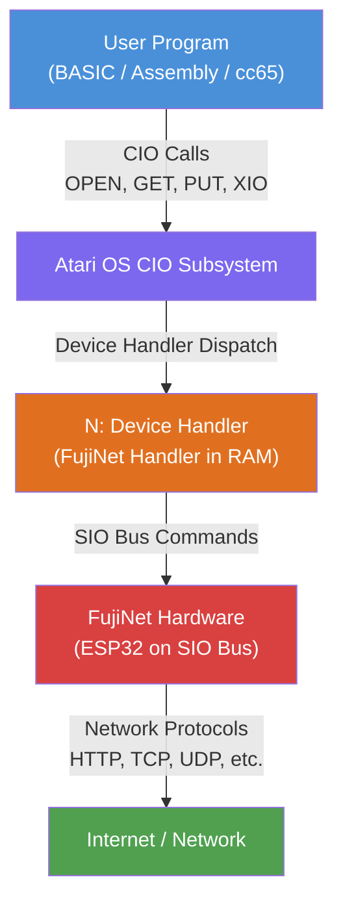

# Atari Programming Overview

Programming the FujiNet on the Atari 8-bit platform revolves around the **SIO (Serial Input/Output)** bus, the same communication layer used by disk drives, printers, and modems. The FujiNet appears as one or more SIO devices, and programs interact with it through the Atari's standard **CIO (Central I/O)** subsystem or directly via **SIO** calls.

## Architecture

The Atari's I/O stack is layered. User programs issue CIO calls, which the operating system translates into low-level SIO bus transactions. The FujiNet `N:` device handler (loaded at boot or from the CONFIG program) sits in this stack and translates CIO operations into the appropriate SIO commands for the FujiNet hardware.



## Device IDs

The FujiNet uses the following SIO device IDs:

| Device ID | Purpose |
|-----------|---------|
| `$70` | **FujiNet Control Device** -- adapter configuration, WiFi management, host/device slot operations, clock, app keys, and other system-level functions |
| `$71` - `$78` | **N: Network Devices** -- up to eight simultaneous network connections, each supporting protocols such as HTTP, HTTPS, TCP, UDP, FTP, TNFS, SMB, and more |

The FujiNet also emulates standard Atari SIO devices (disk drives at `$31`-`$38`, printers, RS-232, etc.), but the `$70` control device and `$71`-`$78` network devices are unique to FujiNet.

## Programming Approaches

### Atari BASIC

The most accessible way to use the FujiNet is through Atari BASIC using `OPEN`, `PRINT#`, `INPUT#`, `GET#`, and `XIO` commands with the `N:` device. The N: handler must be loaded first (it loads automatically when booting from FujiNet CONFIG).

**Quick Start -- Reading a Mastodon Post:**

```basic
0 DIM A$(256)
1 TRAP 91
2 POKE 756,204
10 OPEN #1,12,0,"N:HTTPS://OLDBYTES.SPACE/api/v1/timelines/public?limit=1"
20 XIO 252,#1,12,1,"N:":REM SET CHANNEL MODE TO JSON
30 XIO ASC("P"),#1,12,0,"N:":REM PARSE THE JSON
40 XIO ASC("Q"),#1,12,3,"N:/0/account/display_name"
50 INPUT #1,A$:? A$
60 XIO ASC("Q"),#1,12,3,"N:/0/created_at"
70 INPUT #1,A$:? A$
80 XIO ASC("Q"),#1,12,3,"N:/0/content"
90 GET #1,A:? CHR$(A);:GOTO 90
91 CLOSE #1:? :?
100 POKE 18,0:POKE 19,0:POKE 20,0
110 IF PEEK(19)<30 THEN 110
120 GOTO 1
```

This example opens an HTTPS connection, switches the channel to JSON mode, parses the response, queries specific JSON fields, and prints the results.

### Assembly Language

For maximum performance and control, programmers can issue SIO calls directly from 6502 assembly. This bypasses CIO overhead and communicates with FujiNet device IDs `$70`-`$78` at the bus level. The SIO command frame specifies the device ID, command byte, auxiliary bytes, buffer address, and transfer length.

### cc65 (C Cross-Compiler)

The [cc65](https://cc65.github.io/cc65/) cross-compiler for 6502 targets provides a practical middle ground. The [fujinet-lib](https://github.com/FujiNetWIFI/fujinet-lib) project offers a C library that wraps the SIO interface, making FujiNet programming accessible from C while retaining good performance.

## CIO Commands

The **N: device handler** implements the following standard CIO commands, allowing BASIC and other high-level languages to perform network I/O as if it were file I/O:

| CIO Command | Operation |
|-------------|-----------|
| OPEN (`$03`) | Open a network connection using a URL |
| GET RECORD (`$05`) | Read a line of text (up to EOL) |
| GET CHARACTERS (`$07`) | Read a specified number of bytes |
| PUT RECORD (`$09`) | Write a line of text with EOL |
| PUT CHARACTERS (`$0B`) | Write a specified number of bytes |
| CLOSE (`$0C`) | Close the network connection |
| STATUS (`$0D`) | Get connection status and bytes waiting |

## XIO Commands

The `XIO` statement provides access to extended operations beyond standard CIO:

| XIO Command | Description |
|-------------|-------------|
| `$0F` | Flush write buffer -- forces buffered data to the network |
| `$41` (`'A'`) | Accept a pending TCP client connection |
| `$FC` (252) | Set channel mode (e.g., JSON mode) |
| `$50` (`'P'`) | Parse JSON data |
| `$51` (`'Q'`) | Query a JSON element by path |
| `$FF` | Reset FujiNet |

**XIO Syntax in BASIC:**

```basic
XIO command,#iocb,aux1,aux2,"N:"
```

Where `command` is the XIO code, `#iocb` is the I/O channel (1-7), and `aux1`/`aux2` provide additional parameters.

## SIO Command Reference

For low-level programming (assembly, cc65, or advanced BASIC using `USR` routines), the full SIO command tables are essential references:

- **Device `$70` (FujiNet Control)** -- WiFi management, host/device slots, clock, app keys, boot mode, hashing, Base64, QR codes, and more. See the [SIO Commands for Device $70](../../../reference/sio-commands-70.md) reference.
- **Devices `$71`-`$78` (N: Network)** -- Open, Close, Read, Write, Status, JSON parse/query, channel mode, login/password, file operations, and protocol-specific commands. See the [SIO Commands for Devices $71-$78](../../../reference/sio-commands-71-78.md) reference.

## URL Format

All N: device URLs follow this format:

```
N:PROTO://[HOSTNAME][:PORT]/[PATH]
```

Where:
- **PROTO** is the protocol (`HTTP`, `HTTPS`, `TCP`, `UDP`, `TNFS`, `FTP`, `SMB`, `SSH`, etc.)
- **HOSTNAME** is the destination host (can be omitted for listening sockets)
- **PORT** is the port number (optional for most protocols, required for listening sockets)
- **PATH** is the resource path (optional)

## Further Reading

- [Using HTTP/S from BASIC](../../../guides/atari-https-basic.md)
- [Atari BASIC JSON POST Best Practices](../../../guides/atari-json-post.md)
- [N: Game Developer Cheat Sheet](../../../guides/atari-game-dev-cheatsheet.md)
- [Error Codes for N: Device](../../../reference/n-device-errors.md)
