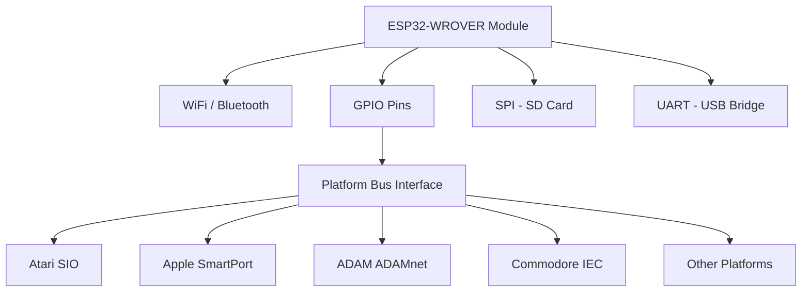

# Board Bring-Up: Hardware

This document covers the steps needed to source, assemble, and set up the required hardware for connecting FujiNet to a new or unsupported platform. Since FujiNet is based on the ESP32, most hardware bring-up revolves around the ESP32 DevKit-C and attaching it to the target serial or parallel interface.

For the software side of board bring-up, see the Board Bring-Up Software documentation. For questions and community support, visit the [FujiNet Discord](https://discord.gg/7MfFTvD).

## Terminology

| Term | Definition |
|------|------------|
| **Platform** | A specific set of hardware from a manufacturer with common I/O characteristics (e.g., Atari 8-bit with SIO, Apple II with SmartPort, ADAM with ADAMnet, Commodore 64 with IEC) |
| **FujiNet** | A hardware peripheral using the ESP32 and various I/O connectors to attach to different platforms |
| **ESP32** | The system-on-chip (SoC) that runs the firmware and connects platforms to the Internet |
| **BOB** | Break-Out Box -- an add-on device that connects to an Atari FujiNet v1.0 and provides pins for connecting to other devices |
| **PlatformIO** | The development environment used to program the ESP32 firmware, available as CLI tools or as a Visual Studio Code extension |

## The ESP32

The ESP32 is the heart of the FujiNet ecosystem. See the [ESP32 Platform Details](esp32.md) page for in-depth specifications. FujiNet always uses the **WROVER** variant, which has more RAM and Flash than the WROOM version. Using a WROOM module will cause issues due to insufficient memory.

## Platforms with Retail Hardware

These platforms have fully assembled, plug-and-play retail FujiNet devices available for purchase.

### Atari 8-Bit

Fully supported with tested hardware, a CONFIG app for the Atari, and a web interface for all FujiNet functions.

- [FujiNet.online](https://fujinet.online/shop)
- [Vintage Computer Center](https://www.vintagecomputercenter.com/fujinet)

See [Official Hardware Versions](official_versions.md) for the full Atari hardware revision history.

### Coleco ADAM

Fully supported with tested hardware, a CONFIG app for the ADAM, and a web interface for most FujiNet functions.

- [FujiNet.online](https://fujinet.online/shop)
- [Vintage Computer Center](https://www.vintagecomputercenter.com/product/colecovision-adam-fujinet)

### Apple II

Fully supported with tested hardware, a CONFIG app for the Apple II, and a web interface for most FujiNet functions.

- [FujiNet.online](https://fujinet.online/shop)

### Commodore 64

The Apple II prototype board can boot a C64 with the addition of an IEC cable connected to the proto board pins. A special MeatLoaf build of FujiNet firmware is required. Visit the [FujiNet Discord](https://discord.gg/7MfFTvD) for assistance with this configuration.

## Building a DevKit

For platforms that do not yet have a dedicated retail FujiNet device, a development kit is required. The DevKit is built around the ESP32-DevKitC board on a solderless breadboard.

### Required Purchases

| Component | Source |
|-----------|--------|
| ESP32-DevKitC (WROVER) | [Mouser](https://www.mouser.com/ProductDetail/Espressif-Systems/ESP32-DevKitC-VE?qs=vmHwEFxEFR%252BnPxzX%2FBK62A%3D%3D) |

### Recommended Purchases

| Component | Purpose |
|-----------|---------|
| Breadboard jumpers | Short connections on the breadboard |
| Dupont wires | Connections between the DevKit and target platform |
| Solderless breadboards | Base for mounting the DevKit and wiring |

### Using a FujiNet v1.0 as a DevKit

The original FujiNet v1.0 board (and **only** the v1.0 board) can serve as a DevKit with the addition of a Break-Out Box (BOB), available from the [FujiNet Online Store](https://fujinet.online/shop/hardware/sio-pass-through-breakout-board-v2-2/). The BOB provides the same GPIO access as a breadboard-based DevKit.

## Platform-Specific Wiring

### Apple II

The Apple II port uses the SmartPort protocol. The target Apple II must have a SmartPort DB19 interface:

- **Apple IIc, IIc+, IIGS** -- SmartPort built in
- **Apple II+, IIe** -- Requires SmartPort ROMs in a Disk II controller, or a [BMOW Yellowstone](https://www.bigmessowires.com/yellowstone/) SmartPort card

#### Required Hardware

| Component | Source |
|-----------|--------|
| BMOW Yellowstone (II+/IIe only) | [Big Mess o' Wires](https://www.bigmessowires.com/yellowstone/) |
| DB-19 Male Adapter (IIc/IIc+/GS) | [FujiNet Online](https://fujinet.online/shop/appleii/db19-to-idc20-adapter-for-apple-ii/) |
| IDC20 cables | Standard IDC20 ribbon cables |

#### GPIO Wiring

Wire the ribbon header from the DB19 adapter to the GPIO pins on the ESP32-DevKitC. The SmartPort signals map to specific GPIO pins as defined in the firmware source code, which also documents the correspondence between Apple SmartPort signals and Atari SIO signals.

### Commodore 64

The C64 uses the IEC bus protocol. An IEC connector from Moz connects directly to the pin-outs on the Apple FujiNet Rev 0 and 00 boards. See the [demonstration video](https://www.youtube.com/watch?v=zNjpFYH9U6k) for a working example.

### Other Platforms

Additional platforms are awaiting community contributions. If you are interested in bringing FujiNet to a new platform, join the [FujiNet Discord](https://discord.gg/7MfFTvD) to coordinate with the development team.

## Logic Analyzers

A logic analyzer is the best tool for diagnosing communication between FujiNet and a target platform. Many FujiNet developers use inexpensive USB logic analyzers based on the Saleae clone design.

### Recommended Hardware

The HiLetgo USB Logic Analyzer (24MHz, 8 channels) is available for approximately $13:

- [Amazon listing](https://www.amazon.com/gp/product/B077LSG5P2)

These are Saleae clones and are compatible with multiple software packages.

### Software

| Software | Description | Link |
|----------|-------------|------|
| PulseView | Open source logic analyzer GUI (sigrok project) | [sigrok.org](https://sigrok.org/wiki/Downloads) |
| Saleae Logic | Official Saleae software (also works with clones) | [saleae.com](https://www.saleae.com/downloads/) |

### Channel Mapping for Apple II

For FujiNet Apple Rev 0 and 00 boards, use the following logic analyzer channel mapping:

| Channel | Signal |
|---------|--------|
| CH0 | RDDATA |
| CH1 | WREQ |
| CH2 | WPROT |
| CH3 | PHI 0 |
| CH4 | PHI 1 |
| CH5 | PHI 2 |
| CH6 | PHI 3 |

Other platforms will have their own standard channel mappings. Consult the platform-specific documentation or the FujiNet Discord for guidance.

## Testing Connectivity

After assembling your DevKit and wiring it to the target platform:

1. **Power up the ESP32** via USB and verify the serial console is accessible
2. **Flash the firmware** using PlatformIO with the correct platform target selected
3. **Check WiFi** -- the FujiNet should broadcast an access point for initial configuration
4. **Monitor the serial console** for bus activity when the target platform is powered on
5. **Use a logic analyzer** to verify signal integrity and timing on the bus interface
6. **Test with the web UI** -- connect to the FujiNet's IP address to access the configuration interface
