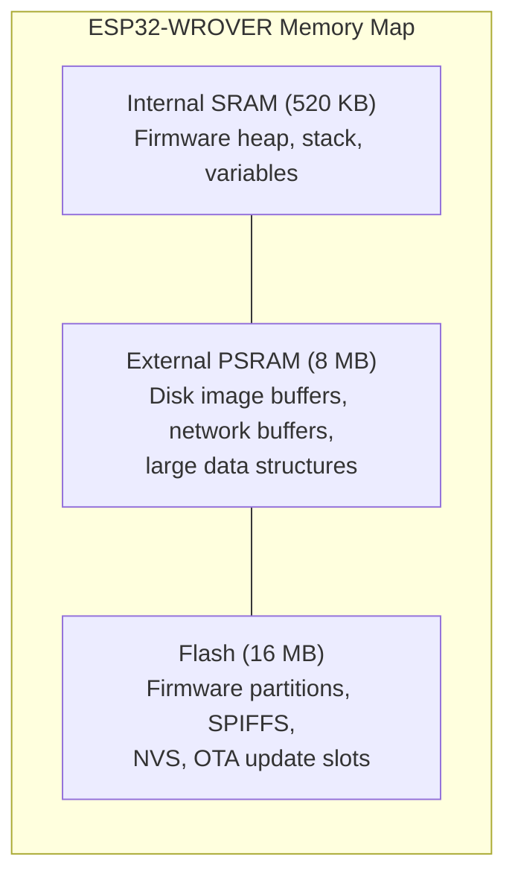
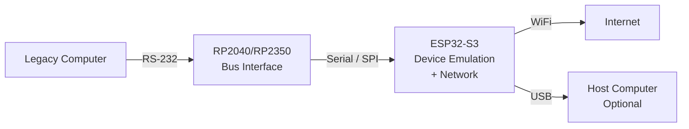

# ESP32 Platform Details

The ESP32 is the heart of every FujiNet device. This page documents the specific ESP32 modules, configurations, and capabilities used across the FujiNet ecosystem.

## ESP32-WROVER Module

FujiNet exclusively uses the **ESP32-WROVER** module variant. The WROVER provides significantly more RAM and Flash than the WROOM variant, which is required for FujiNet's firmware to function correctly.

> **Important:** Do not use ESP32-WROOM modules with FujiNet. The reduced memory will cause firmware instability and failures.

### WROVER vs WROOM Comparison

| Feature | WROVER | WROOM |
|---------|--------|-------|
| Flash | 16 MB | 4 MB |
| PSRAM | 8 MB | None |
| SPI RAM | Yes (external) | No |
| Package | Larger (with PSRAM chip) | Smaller |
| FujiNet Compatible | Yes | No |

### Module Specifications

| Parameter | Value |
|-----------|-------|
| SoC | ESP32-D0WD (dual-core Xtensa LX6) |
| Clock Speed | Up to 240 MHz |
| Flash Memory | 16 MB (SPI) |
| PSRAM | 8 MB (SPI) |
| SRAM | 520 KB |
| ROM | 448 KB |
| WiFi | 802.11 b/g/n, 2.4 GHz |
| Bluetooth | v4.2 BR/EDR and BLE |
| Operating Voltage | 3.3V |
| Operating Temperature | -40 to 85 C |

## GPIO Pinout

The ESP32 provides a rich set of GPIO pins used by FujiNet for bus communication, SD card access, LEDs, buttons, and other peripherals. The exact pin assignments vary by platform.

### Atari 8-Bit GPIO Assignments

```mermaid
graph LR
    subgraph ESP32 GPIO
        direction TB
        SIO_CMD[GPIO - SIO Command]
        SIO_DI[GPIO - SIO Data In]
        SIO_DO[GPIO - SIO Data Out]
        SIO_CLK[GPIO - SIO Clock]
        SIO_MTR[GPIO - SIO Motor]
        SIO_PROC[GPIO - SIO Proceed]
        SIO_IRQ[GPIO - SIO Interrupt]
        SD_CS[GPIO - SD CS]
        SD_MOSI[GPIO - SD MOSI]
        SD_MISO[GPIO - SD MISO]
        SD_CLK[GPIO - SD CLK]
        SD_DET[GPIO 15 - SD Detect]
        LED1[GPIO - WiFi LED]
        LED2[GPIO - BT LED]
        LED3[GPIO - SIO LED]
        BTN_A[GPIO - Button A]
        BTN_B[GPIO - Button B]
    end
```

### Key Pin Functions

| Function | Interface | Notes |
|----------|-----------|-------|
| SIO Bus | UART / GPIO | Command, Data In, Data Out, Clock, Motor, Proceed, Interrupt |
| SD Card | SPI | CS, MOSI, MISO, CLK, Card Detect (v1.6+: GPIO 15) |
| USB-UART | CP2102 Bridge | TX, RX, RTS, DTR for flashing and serial console |
| LEDs | GPIO (output) | WiFi status, Bluetooth/SIO2BT, SIO activity |
| Buttons | GPIO (input) | Button A (swap), Button B (safe reset), Hard Reset |

### SIO Bus Interface (Atari)

On v1.3 and later boards, SIO lines pass through two 74LS07 open-collector buffer ICs. P-channel and N-channel transistors disconnect the buffers when FujiNet is powered off, electrically isolating the ESP32 from the Atari bus.

| Signal | Direction | Buffer | Notes |
|--------|-----------|--------|-------|
| Command | Atari to FN | 74LS07 | Active low |
| Data In | Atari to FN | 74LS07 | 4.7k pull-up (v1.5+) |
| Data Out | FN to Atari | 74LS07 | |
| Motor | Atari to FN | 74LS07 | 10k pull-up ESP side, 2k pull-down Atari side (v1.6+) |
| Proceed | FN to Atari | 74LS07 | Active low |
| Interrupt | FN to Atari | 74LS07 | Active low |

## Memory Layout

The ESP32-WROVER's memory is used by FujiNet firmware as follows:

### Flash Partition Layout

| Partition | Purpose |
|-----------|---------|
| Bootloader | ESP-IDF second-stage bootloader |
| Partition Table | Defines flash layout |
| NVS | Non-volatile storage for WiFi credentials and settings |
| OTA Data | Tracks which OTA slot is active |
| App0 | Primary firmware image |
| App1 | Secondary firmware image (OTA updates) |
| SPIFFS | File system for web UI assets and configuration |

### PSRAM Usage

The 8 MB of external PSRAM is critical for FujiNet operations:

- **Disk image buffering** -- caching sectors from SD card or network sources
- **Network buffers** -- HTTP response bodies, TNFS data
- **Printer output** -- PDF generation buffers
- **Protocol adapters** -- translation buffers for platform-specific protocols

## WiFi Capabilities

| Feature | Specification |
|---------|---------------|
| Standards | 802.11 b/g/n |
| Frequency | 2.4 GHz |
| Security | WEP, WPA, WPA2-PSK, WPA2-Enterprise |
| Mode | Station (client) and SoftAP (access point) |
| Antenna | On-module PCB antenna (default) or external via U.FL/IPEX connector |

### WiFi Operating Modes

1. **SoftAP Mode** -- On first boot or after config reset, FujiNet creates its own access point for initial setup
2. **Station Mode** -- Normal operation, connecting to a user's WiFi network
3. **Concurrent Mode** -- Both AP and Station can run simultaneously during configuration

### External Antenna

Starting with hardware v1.6, FujiNet supports an external antenna option. This requires:

- A U.FL/IPEX connector on the ESP32-WROVER module
- Correct resistor placement on the module to route the RF signal to the external connector
- A compatible 2.4 GHz antenna
- The external antenna case design (available in the hardware repository)

## ESP32-S3 for RS-232

The next-generation FujiNet architecture uses the **ESP32-S3** variant for RS-232-based platforms. This is part of the universal FujiNet design that pairs an ESP32 (or host computer) with an **RP2040 or RP2350** ARM processor as the physical bus interface.

### ESP32-S3 Advantages

| Feature | ESP32 (Original) | ESP32-S3 |
|---------|-------------------|----------|
| CPU | Dual Xtensa LX6 | Dual Xtensa LX7 |
| USB | Requires external bridge | Native USB OTG |
| AI Acceleration | None | Vector instructions |
| Security | Basic | Secure boot v2, flash encryption |
| GPIO Count | 34 | 45 |

### RS-232 Architecture

In the RS-232 design, the system is split between two processors:

The RP2040/RP2350 handles the physical bus timing and protocol requirements, while the ESP32-S3 (or a host computer running FujiNet-PC) manages device emulation, network communication, and the web interface. This separation allows the bus interface to meet strict timing requirements independently of the higher-level application logic.

## Development Board

For platform development, FujiNet uses the **ESP32-DevKitC-VE**, which provides:

- ESP32-WROVER-E module
- USB-to-UART bridge (CP2102 or similar)
- Boot and Reset buttons
- Breadboard-compatible pin headers
- 3.3V and 5V power rails

See the [Board Bring-Up](board_bring_up.md) page for instructions on setting up a DevKit for new platform development.
