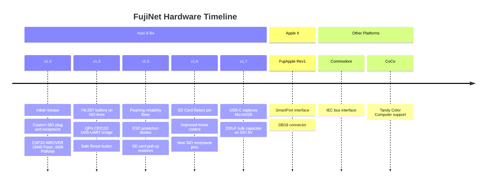

# Official Hardware Versions

Official FujiNet hardware designs are open source and released in the [fujinet-hardware](https://github.com/FujiNetWiFi/fujinet-hardware) repository. This page documents the evolution of FujiNet hardware across all supported platforms.

## Platform Overview

## Atari 8-Bit

### Version 1.7 (Current)

Changes from v1.6:

- Replace MicroUSB with USB-C port
- Add 220uF bulk capacitor to SIO 5V

### Version 1.6

Changes from v1.5:

- Add SD Card Detect pin on GPIO 15
- Change SIO 5V voltage divider for better accuracy
- Run Motor Control signal through buffer
  - 10K pullup on ESP side Motor Control
  - 2K pulldown on Atari Side Motor Control
- New SIO Receptacle pins for better fit with all SIO cables
- Case changes:
  - Increase screw hole size
  - New plug without mounting holes
  - Tighter tolerance for SIO plug with added supports
  - Modified 3D printed receptacle for new pins
  - New external antenna case designs (requires U.FL/IPEX connector and correct resistor placement on ESP32 WROVER module)

### Version 1.5

Changes from v1.3:

- Flashing problem fix:
  - Add resistor divider on CP2102 VBUS
  - Add CP2102 capacitors
  - Connect CP2102 VIO to VDD
  - Change auto-reset pull-up resistors from 1k to 10k
  - Change auto-reset/EN capacitance to 4.7uF
- Add ESD (TVS) protection diodes for USB input
- Change USB port footprint to use slots
- Add 4.7k pull-up resistor to SIO\_DATAIN
- Add 10k pull-up resistors for microSD card
- Change SIO AUDIO\_IN resistor to 10K for softer SAM output

### Version 1.3

> **Note:** This hardware version contains a bug that prevents some computers from upgrading FujiNet firmware. A [hardware fix](https://github.com/FujiNetWIFI/fujinet-hardware/blob/master/Old-Versions/FN32ROV-1.3-Q24/CP210x_RESET-BUG_FIX_FINAL.jpg) can be applied to these boards.

Changes from v1.0:

- SIO lines connected to ESP32 through two 74LS07 buffers
- P and N channel transistors turn off 74LS07 when FujiNet is powered off, separating the ESP32 from the Atari
- Switch to QFN 24 CP2102 USB-to-UART bridge
- Hard reset button moved to SMD Snap Dome (optional)
- Safe Reset button (handled in firmware) replaces Hard Reset button
- New power switch with 3D printed slide cover
- Remove always-on solder jumper
- Add pull-down for MOTOR for cassette emulation
- JTAG port removed; signals available as test points

### Version 1.0

The original FujiNet design features a custom SIO plug that connects directly into any Atari 8-bit computer, with a custom SIO receptacle on the back for daisy-chaining other Atari peripherals. The heart of FujiNet is an ESP32-WROVER module with 16MB Flash and 8MB PSRAM.

| Feature | Description |
|---------|-------------|
| Processor | ESP32-WROVER, 16MB Flash, 8MB PSRAM |
| Storage | MicroSD socket (right side) |
| Connectivity | Custom SIO plug and receptacle, MicroUSB |
| Power | Via SIO connector or MicroUSB |

#### Buttons

| Button | Short Press | Long Press | Other |
|--------|-------------|------------|-------|
| **A** (Left) | Disk swap | Enable/disable SIO2BT mode | |
| **B** (Middle left) | Cassette emulation on | Safe reset (unmounts SD before reboot) | Double tap: serial debug info. Hold during power-up: reset config |
| **Hard Reset** (Right) | Hardware reset | | |

#### LED Indicators

| LED | Color | Function |
|-----|-------|----------|
| Left | White | WiFi status |
| Middle left | Blue | SIO2BT mode |
| Right | Orange | SIO activity |

## Version Changelog Summary

| Version | Key Changes |
|---------|-------------|
| v1.0 | Initial release with custom SIO plug, ESP32-WROVER, MicroSD, 3 buttons, 3 LEDs |
| v1.3 | 74LS07 buffers, QFN CP2102, Safe Reset button, power switch |
| v1.5 | Flashing fixes, ESD protection, SD card pull-ups |
| v1.6 | SD Card Detect, improved motor control, new SIO receptacle |
| v1.7 | USB-C port, bulk capacitor on SIO 5V |

## Apple II - FujiApple Rev1

The FujiApple Rev1 is the official Apple II FujiNet hardware. It interfaces with Apple II computers via the SmartPort protocol using a DB19 connector. Compatible systems include the Apple IIc, IIc+, and IIGS (which have SmartPort built in), as well as Apple II+ and IIe with a SmartPort-compatible controller card such as the [BMOW Yellowstone](https://www.bigmessowires.com/yellowstone/).

Purchase options:

- [FujiNet.online](https://fujinet.online/shop)

## Commodore

The Commodore platform connects via the IEC bus. See the [Board Bring-Up](board_bring_up.md) page for development wiring details.

## Tandy CoCo

The Tandy Color Computer (CoCo) platform is supported with retail hardware.

## Prototype Versions

Earlier prototype board revisions are documented in the fujinet-hardware repository. These pre-release designs informed the development of the v1.0 and later official boards.
