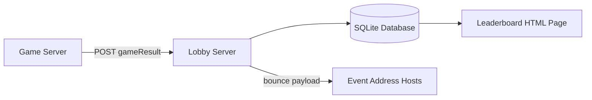
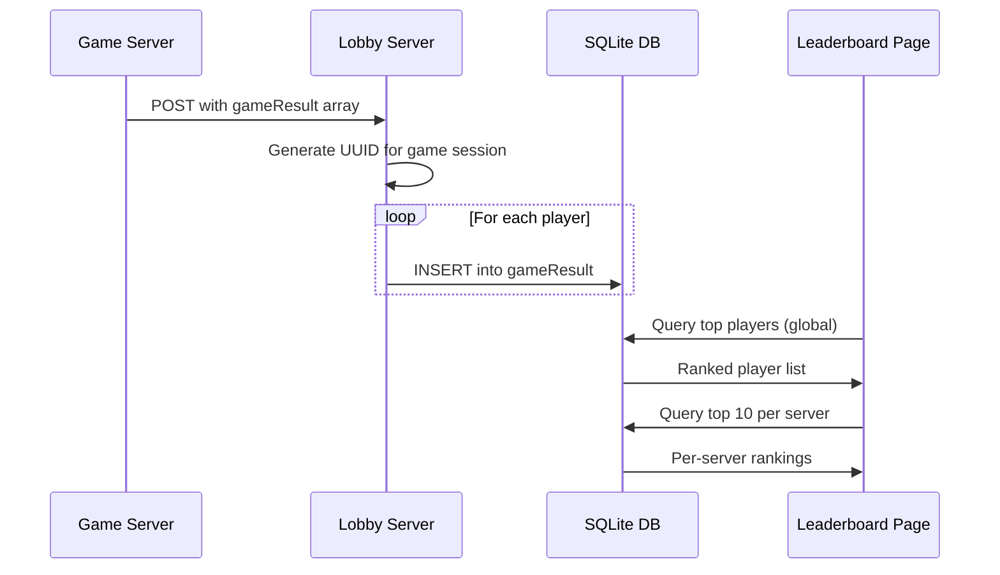

# FEP 002: Lobby/Leaderboard Specification

| Field | Value |
|-------|-------|
| FEP ID | 002 |
| Title | Game Events and Leaderboard in Lobby |
| Author | Andrew Diller |
| Status | Draft |
| Type | Informational |
| Created | 2025-05-09 |
| Version | 1.0 |
| Input | EricC, RogerS |

## Abstract

This document defines a standard approach for enhancing the existing FujiNet lobby server service by introducing a persistent leaderboard system based on multiplayer game outcomes. The enhancement involves creating a new `gameResult` table within the service's SQLite database to store detailed player performance data, including game identifiers, server information, player names, win status, and player type. A new HTML leaderboard page presents aggregated player statistics in two formats: a global ranking of players by total wins, and per-server listings of the top 10 winning players.

## Architecture Overview



## Lobby Logic

As Game Server (GS) events flow into the Lobby Server (LS), the server processes them with the following logic:

```
If gameResult exists in POST body:
    - Create a new UUID for this game
    - Loop over the array of players in the gameResult:
        - For each player, create a new row in the gameResult table:
            gameID, gameName, gameServer, playerName,
            playerWinner, playerType, datetime

Else:
    - Continue with normal processing
    - Bounce the entire payload to any evtaddr hosts specified
      when the server was instantiated
```

## Database Schema

### gameResult Table

| Column | Type | Description |
|--------|------|-------------|
| `id` | INTEGER | Primary key, auto-increment |
| `timedate` | DATETIME | Timestamp of the game result |
| `gameID` | INTEGER | Unique identifier for the game session |
| `gameName` | VARCHAR(80) | Name of the game |
| `gameServer` | VARCHAR(80) | Name/identifier of the game server |
| `playerName` | VARCHAR(80) | Name of the player |
| `playerWinner` | BOOLEAN | Whether this player won |
| `playerType` | ENUM | `human` or `bot` |

## Queries

### Top Players by Wins (All Games)

Returns a global ranking of all human players ordered by total wins:

```sql
SELECT playerName, COUNT(*) AS wins
FROM gameResult
WHERE playerWinner = 1 AND playerType = 'human'
GROUP BY playerName
ORDER BY wins DESC;
```

### Top 10 Players Per Server

Returns the top winning human players grouped by game server:

```sql
SELECT gameServer, playerName, COUNT(*) AS wins
FROM gameResult
WHERE playerWinner = 1 AND playerType = 'human'
GROUP BY gameServer, playerName
HAVING wins > 0
ORDER BY gameServer, wins DESC;
```

### SQLite Compatibility Note

For SQLite versions prior to 3.25 (which lack `ROW_NUMBER()` support), a correlated subquery can be used to limit results to the top 10 per server:

```sql
SELECT *
FROM (
  SELECT gameServer, playerName, COUNT(*) AS wins
  FROM gameResult
  WHERE playerWinner = 1 AND playerType = 'human'
  GROUP BY gameServer, playerName
)
WHERE (
  SELECT COUNT(*) FROM gameResult AS gr
  WHERE gr.playerWinner = 1 AND gr.playerType = 'human'
    AND gr.gameServer = gameResult.gameServer
    AND (
      SELECT COUNT(*) FROM gameResult
      WHERE playerWinner = 1 AND playerType = 'human'
        AND gameServer = gr.gameServer
        AND playerName = gr.playerName
    ) <= 10
);
```

## Leaderboard Page

The leaderboard HTML page presents two views:

### Global Rankings

A table of all human players ranked by total wins across all games and servers.

| Rank | Player Name | Wins |
|------|-------------|------|
| 1 | andyXEL | 42 |
| 2 | frank | 31 |
| ... | ... | ... |

### Per-Server Rankings

A table showing the top 10 human winners for each individual game server.

| Server | Player Name | Wins |
|--------|-------------|------|
| AI Room - 2 bots | andyXEL | 25 |
| AI Room - 2 bots | frank | 18 |
| ... | ... | ... |

## Data Flow



## See Also

- [FEP 001: URL Parsing](fep_001.md) -- URL handling for client applications
- [FEP 003: NetSIO Protocol](fep_003.md) -- Network protocol for emulator communication
