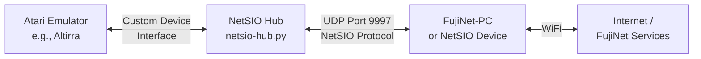
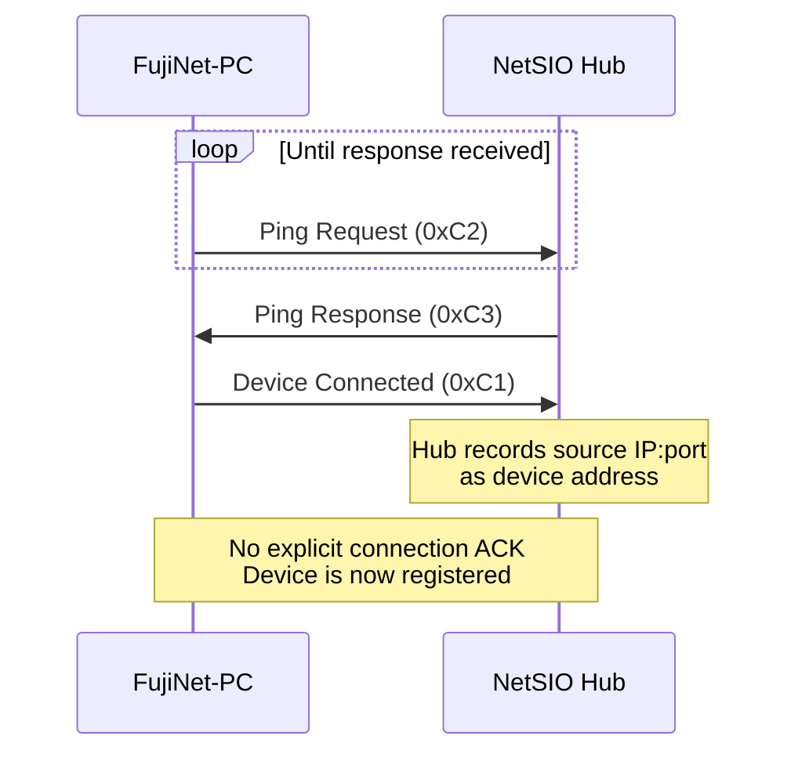

# FEP 003: NetSIO Protocol Specification

| Field | Value |
|-------|-------|
| FEP ID | 003 |
| Title | NetSIO Protocol |
| Author | Andrew Diller, Jan Krupa |
| Status | Draft |
| Type | Informational |
| Created | 2025-04-23 |
| Version | 1.0 |
| Input | Jan, Mozzwald, TCH |

## Abstract

NetSIO is a lightweight protocol for transmitting Atari SIO (Serial Input/Output) signals and data over UDP, enabling network-based communication with peripherals like FujiNet. While no existing Atari emulator natively supports NetSIO, developers can implement direct support by writing code to handle the protocol and communicate with FujiNet devices. The `netsio-hub.py` reference implementation (written in Python 3) translates Altirra emulator messages into NetSIO datagrams and vice versa.

**Transport:** UDP, Port 9997

## Current Implementations

| Implementation | Language | Repository |
|----------------|----------|------------|
| NetSIO Hub | Python 3 | [fujinet-emulator-bridge](https://github.com/FujiNetWIFI/fujinet-emulator-bridge) |
| NetSIO Able Archer | C89 | [dillera/atari800](https://github.com/dillera/atari800) |
| NetSIO Mozzable | C89 | [mozzwald/atari800](https://github.com/mozzwald/atari800) |

## Architecture

## Connection Phase

The connection sequence between FujiNet-PC and the NetSIO hub proceeds as follows:

Key points:

- FujiNet-PC repeatedly sends Ping Requests (`0xC2`) until a Ping Response (`0xC3`) is received
- FujiNet-PC then sends Device Connected (`0xC1`) to register with the hub
- The hub records the source IP:port of the Device Connected message as the device address
- There is no specific connection acknowledgment from the hub back to FujiNet-PC

## Protocol Messages

### Message Summary

| Message | ID | Parameters | Direction |
|---------|----|------------|-----------|
| [Data Byte](#data-byte) | `0x01` | `data_byte: uint8` | Bidirectional |
| [Data Block](#data-block) | `0x02` | `byte_array: uint8[]` | Bidirectional |
| [Data Byte + Sync Request](#data-byte-and-sync-request) | `0x09` | `data_byte: uint8`, `sync_number: uint8` | Atari to Device |
| [Command OFF](#command-off) | `0x10` | none | Atari to Device |
| [Command ON](#command-on) | `0x11` | none | Atari to Device |
| [Command OFF + Sync Request](#command-off-and-sync-request) | `0x18` | `sync_number: uint8` | Atari to Device |
| [Motor OFF](#motor-off) | `0x20` | none | Atari to Device |
| [Motor ON](#motor-on) | `0x21` | none | Atari to Device |
| [Interrupt OFF](#interrupt-off) | `0x30` | none | Device to Atari |
| [Interrupt ON](#interrupt-on) | `0x31` | none | Device to Atari |
| [Proceed OFF](#proceed-off) | `0x40` | none | Device to Atari |
| [Proceed ON](#proceed-on) | `0x41` | none | Device to Atari |
| [Speed Change](#speed-change) | `0x80` | `baud: uint32` (little-endian) | Bidirectional |
| [Sync Response](#sync-response) | `0x81` | `sync_number`, `ack_type`, `ack_byte`, `write_size` | Device to Atari |
| [Device Disconnected](#device-disconnected) | `0xC0` | none | Device to Hub |
| [Device Connected](#device-connected) | `0xC1` | none | Device to Hub |
| [Ping Request](#ping-request) | `0xC2` | none | Device to Hub |
| [Ping Response](#ping-response) | `0xC3` | none | Hub to Device |
| [Alive Request](#alive-request) | `0xC4` | none | Device to Hub |
| [Alive Response](#alive-response) | `0xC5` | none | Hub to Device |
| [Credit Status](#credit-status) | `0xC6` | `credit: uint8` | Device to Hub |
| [Credit Update](#credit-update) | `0xC7` | `credit: uint8` | Hub to Device |
| [Warm Reset](#warm-reset) | `0xFE` | none | Atari to Device |
| [Cold Reset](#cold-reset) | `0xFF` | none | Atari to Device |

> With the exception of Ping, a device must first send Device Connected (`0xC1`) before participating in NetSIO communication.

### Data Transfer Messages

#### Data Byte

| Field | Value |
|-------|-------|
| ID | `0x01` |
| Direction | Atari to Device, Device to Atari |
| Parameters | `data_byte: uint8` -- byte to transfer |

Transfers a single SIO data byte. Used for (but not limited to) completion byte `C` or checksum byte.

#### Data Block

| Field | Value |
|-------|-------|
| ID | `0x02` |
| Direction | Atari to Device, Device to Atari |
| Parameters | `byte_array: uint8[]` -- one or more bytes (up to 512) |

Transfers multiple data bytes in a single message.

#### Data Byte and Sync Request

| Field | Value |
|-------|-------|
| ID | `0x09` |
| Direction | Atari to Device |
| Parameters | `data_byte: uint8`, `sync_number: uint8` |

Transfers a data byte together with a request to synchronize on the next byte from Device to Atari. Atari emulation is **paused** waiting for the Sync Response.

Used on the last byte (checksum) of an SIO write command when Atari sends a data frame and expects an ACK/NAK within 850 us to 16 ms. The acknowledgment is delivered via Sync Response, and emulation resumes afterward. This pause-resume mechanism extends the 16 ms timing requirement for acknowledgment delivery over network connections.

### Command Signals

#### Command ON

| Field | Value |
|-------|-------|
| ID | `0x11` |
| Direction | Atari to Device |

Command asserted. Atari indicates to all connected devices the start of a command frame. The command pin uses **negative logic** (active = low voltage on SIO pin).

#### Command OFF

| Field | Value |
|-------|-------|
| ID | `0x10` |
| Direction | Atari to Device |

Command de-asserted. Indicates the end of a command frame. Currently not used directly; see Command OFF and Sync Request.

#### Command OFF and Sync Request

| Field | Value |
|-------|-------|
| ID | `0x18` |
| Direction | Atari to Device |
| Parameters | `sync_number: uint8` |

Command de-asserted with a sync request. Atari expects an ACK/NAK within 16 ms of the command frame ending. The sync mechanism extends this timing requirement for network-connected devices.

### Motor Signals

#### Motor ON / Motor OFF

| Signal | ID |
|--------|----|
| Motor ON | `0x21` |
| Motor OFF | `0x20` |

Direction: Atari to Device. Controls the cassette player motor signal.

### Proceed and Interrupt Signals

#### Proceed ON / Proceed OFF

| Signal | ID |
|--------|----|
| Proceed ON | `0x41` |
| Proceed OFF | `0x40` |

Direction: Device to Atari. The device indicates to the Atari that it needs attention (e.g., data available for read). Uses **negative logic**.

#### Interrupt ON / Interrupt OFF

| Signal | ID |
|--------|----|
| Interrupt ON | `0x31` |
| Interrupt OFF | `0x30` |

Direction: Device to Atari. Similar to Proceed -- the device indicates it needs attention. Uses **negative logic**.

### Speed Change

| Field | Value |
|-------|-------|
| ID | `0x80` |
| Direction | Bidirectional |
| Parameters | `baud: uint32` -- 4 bytes, little-endian |

Indicates that the outgoing data rate has changed. When transferring data to the emulated Atari, data bits "arrive" at the SIO Data In pin at the specified rate. In the opposite direction, the bitrate is complementary information that can be used to simulate errors when the device expects a different bitrate (e.g., toggling between standard 19200 and high speed).

### Sync Response

| Field | Value |
|-------|-------|
| ID | `0x81` |
| Direction | Device to Atari |
| Parameters | `sync_number: uint8`, `ack_type: uint8`, `ack_byte: uint8`, `write_size: uint16` (LSB+MSB) |

Response to Command OFF + Sync Request or Data Byte + Sync Request.

- **sync_number** -- matches the request
- **ack_type**:
  - `0` = Empty acknowledgment (device not interested in this command); other fields ignored
  - `1` = Valid acknowledgment; `ack_byte` will be sent to Atari
- **ack_byte** -- the byte Atari is waiting for (ACK = 65/`A`, NAK = 78/`N` for standard SIO)
- **write_size** -- non-zero means current command is SIO write and next sync is expected after this many bytes; zero means do not plan next sync

### Connection Management

#### Device Connected / Device Disconnected

| Message | ID | Direction |
|---------|----|-----------|
| Device Connected | `0xC1` | Device to Hub |
| Device Disconnected | `0xC0` | Device to Hub |

Registers or unregisters a device from the NetSIO bus.

#### Ping Request / Ping Response

| Message | ID | Direction |
|---------|----|-----------|
| Ping Request | `0xC2` | Device to Hub |
| Ping Response | `0xC3` | Hub to Device |

Tests hub availability. Can be used to measure network round-trip time.

#### Alive Request / Alive Response

| Message | ID | Direction |
|---------|----|-----------|
| Alive Request | `0xC4` | Device to Hub |
| Alive Response | `0xC5` | Hub to Device |

The device must send Alive Requests at regular intervals to maintain its connection. The hub responds to confirm the connection is still active.

### Flow Control (Credit System)

#### Credit Status / Credit Update

| Message | ID | Direction | Parameters |
|---------|----|-----------|------------|
| Credit Status | `0xC6` | Device to Hub | `credit: uint8` -- remaining credit |
| Credit Update | `0xC7` | Hub to Device | `credit: uint8` -- credit granted |

The credit system provides flow control for messages that require emulator processing (data bytes, proceed, interrupt). Each message sent consumes one credit. When a device runs out of credit, it sends Credit Status and waits for Credit Update before proceeding. This prevents the emulator's incoming message queue from being overfilled while allowing a small number of messages to be queued for processing.

### Reset Notifications

#### Warm Reset / Cold Reset

| Message | ID | Description |
|---------|----|-------------|
| Warm Reset | `0xFE` | Emulated Atari performed a warm reset |
| Cold Reset | `0xFF` | Emulated Atari performed a cold reset (power cycle) |

Direction: Atari to Device. The device may react to a cold reset by resetting itself to simulate being powered from the Atari.

## Command Frame Structure

A command frame consists of three UDP packets (NetSIO messages):

1. **Packet 1:** `0x11` (Command ON)
2. **Packet 2:** `0x02` followed by 4 bytes of command frame data + checksum (Data Block)
3. **Packet 3:** `0x81`, sync\_number (Sync Response expected)

## Atari800 Emulator Integration

### SIO Paths

The atari800 emulator has two code paths for SIO command frames:

- `SIO_SwitchCommandFrame()` -- traditional SIO path, called from `pia.c`
- `SIO_Handler()` -- shortcut/patch for the `$E459` SIO call, handled by the emulator rather than emulated Atari code

The recommended approach for NetSIO integration uses the non-patch path:

1. Hook `SIO_PutByte()` to send Data Byte messages (`0x01`)
2. Hook `SIO_SwitchCommandFrame()` to send Command ON/OFF (`0x11`/`0x10`)
3. Optimize by replacing single Data Byte messages with Data Block messages (`0x02`)
4. Handle the response direction via `SIO_GetByte()`

Patch emulation can be disabled with the `-nopatchall` command-line switch.

## See Also

- [FEP 001: URL Parsing](fep_001.md) -- URL handling for client applications
- [FEP 004: FujiNet Protocol](fep_004.md) -- Universal FujiNet packet protocol
- [Virtualization Overview](../../virtualization/overview.md) -- Using FujiNet with emulators
