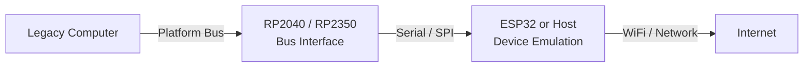
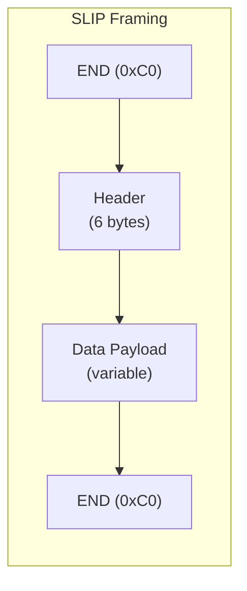
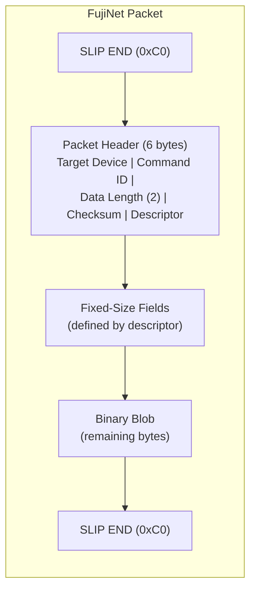

# FEP 004: FujiNet Protocol Specification

| Field | Value |
|-------|-------|
| FEP ID | 004 |
| Title | FujiNet Protocol |
| Author | FozzTexx |
| Status | Draft |
| Type | Informational |
| Created | 2025-10-06 |
| Updated | 2025-11-05 |
| Version | 1.1 |

## Motivation

As FujiNet expands beyond its original Atari and Apple implementations, maintaining consistency and interoperability across platforms has become increasingly difficult. Each platform currently implements the FujiNet protocol in slightly different ways, often resulting in duplicated codebases and redundant logic. When a bug is fixed or a feature is added on one platform, the change rarely propagates automatically to others -- every update must be manually ported, tested, and maintained separately.

The core reason for this duplication lies in how packets are structured and parsed. The existing protocol uses fixed headers and context-dependent payloads, requiring each command handler to read its own data in a custom way. This design forces per-platform command handling logic.

### Universal FujiNet Architecture

With the move toward a universal FujiNet architecture (modeled on the RS-232 version), future devices will use a **Raspberry Pi RP2040 or RP2350** as the physical bus interface, with an **ESP32 or host computer** managing device emulation and network communication. In this architecture, the bus interface and device logic may run on different processors, making serialization and deserialization efficiency critical.

### Design Goals

By making packets **self-describing**, each packet indicates the sizes of its fields so they can be fully decoded immediately upon receipt:

- **Generic decoding** -- packets can be parsed into C/C++ structures immediately upon receipt
- **Modular command handling** -- common handling implemented once in a base class, device-specific logic in subclasses
- **Code reuse** -- shared parsing, debugging, and validation routines across all platforms
- **Protocol introspection** -- tools can decode packets without hardcoded command definitions
- **Forward compatibility** -- new fields or data types can be introduced without breaking existing implementations
- **Legacy compatibility** -- implementable on 6502, 8080, and other 8-bit processors

## Proposed Protocol

The new FujiNet protocol consists of two main parts:

1. **Packet Structure**
2. **Packet Synchronization**

## Packet Structure

Each packet consists of a fixed-length header, a variable-length field section, and an optional binary blob.

### Packet Header

| Field | Size (bytes) | Description |
|-------|-------------|-------------|
| Target Device | 1 | ID of the target device |
| Command ID | 1 | The command to execute |
| Data Length | 2 | Total length of the data payload |
| Checksum | 1 | Simple XOR or sum checksum |
| Data Descriptor | 1 | Byte encoding of the data field layout |

### Data Descriptor Byte

The data descriptor byte defines the layout of fixed-size fields in the data payload:

| Bit(s) | Name | Description |
|--------|------|-------------|
| 7 | More Descriptors | If set, the following byte is an additional descriptor |
| 6-3 | Reserved | Must be set to 0 |
| 2-0 | Field Count/Size | Number and type of fixed-size fields (0-7) |

### Field Descriptor Values

After examining all current FujiNet commands, there are only 8 different combinations of parameter arguments:

| Descriptor Value | Field Count | Field Type | Total Bytes |
|-----------------|-------------|------------|-------------|
| 0 | 0 | -- | 0 |
| 1 | 1 | `uint8_t` | 1 |
| 2 | 2 | `uint8_t` | 2 |
| 3 | 3 | `uint8_t` | 3 |
| 4 | 4 | `uint8_t` | 4 |
| 5 | 1 | `uint16_t` | 2 |
| 6 | 2 | `uint16_t` | 4 |
| 7 | 1 | `uint32_t` | 4 |

### Descriptor Decoding

For non-zero descriptor values, decrement by 1 and inspect bits 2-1:

| Bit Mask | Meaning |
|----------|---------|
| `0b100` | Types are either `uint16_t` or `uint32_t` |
| `0b010` | Type is `uint32_t` |

This allows field types and counts to be determined with either a pair of lookup tables or simple bitmask operations, keeping the implementation lightweight for 8-bit processors.

### Endianness

All multi-byte fields in the FujiNet protocol are transmitted in **little-endian** byte order.

## Packet Synchronization (SLIP Encoding)

The existing protocol used an out-of-band signal via an extra pin to indicate packet boundaries. This does not work with network or USB virtual serial interfaces.

The new protocol uses **SLIP-style encoding** (Serial Line Internet Protocol) for framing:

| Description | Hex | Dec | Abbreviation | Notes |
|-------------|-----|-----|--------------|-------|
| Frame End | `0xC0` | 192 | END | Marks start and end of a packet |
| Frame Escape | `0xDB` | 219 | ESC | Next byte is a transposed value |
| Transposed Frame End | `0xDC` | 220 | ESC\_END | Replaces `0xC0` in payload |
| Transposed Frame Escape | `0xDD` | 221 | ESC\_ESC | Replaces `0xDB` in payload |

### SLIP Rules

1. Packets **start and end** with `END` (`0xC0`)
2. Any `0xC0` in the payload is replaced with `ESC` (`0xDB`) + `ESC_END` (`0xDC`)
3. Any `0xDB` in the payload is replaced with `ESC` (`0xDB`) + `ESC_ESC` (`0xDD`)
4. SLIP encoding is applied **after** the packet has been fully constructed
5. SLIP decoding is applied immediately upon reception, **before** processing the packet
6. All reply data from FujiNet devices is also SLIP-encoded

> Transports that already provide start/stop signaling can use the same packet format without SLIP framing.

## Complete Packet Layout

## Open Questions

### Returning Data to Legacy Systems

- Should reply data be wrapped in a full FujiNet packet (with header, descriptor, and checksum) or sent as a SLIP-encoded payload only?
- If a packet is used, what is the meaning of the Device ID and Command ID in the reply -- do they echo the original command or indicate a special "reply" type?

### Signaling Data Availability

The protocol is command/response, but legacy systems may need notification when data or events are waiting. Challenges include:

- Many older systems have at best a single-byte serial buffer and may not support interrupts
- Systems with no buffer cannot receive unsolicited data over serial
- RS-232 can use out-of-band signal lines (e.g., Ring Indicator), but this does not generalize to all buses
- A cross-platform method for alerting legacy computers to pending data is needed

### Direct Communication with RP2nnn

Scenarios such as resetting the RP2040/RP2350 or uploading new firmware require a communication path:

- A special device ID filtered by the RP2nnn (requires the RP2nnn to monitor pass-through data)
- A second virtual serial interface (e.g., `/dev/ttyACM2`) dedicated to RP2nnn management

### Systems Without RP2nnn

The protocol should remain generic for deployments without an RP2040/RP2350:

- Can the FujiNet safely ignore the absence of an RP2nnn?
- How can the protocol remain flexible for both simple and full-featured configurations?

## References

- [SLIP - Serial Line Internet Protocol](https://en.wikipedia.org/wiki/Serial_Line_Internet_Protocol)
- [FujiNet firmware command definitions](https://github.com/FujiNetWIFI/fujinet-firmware/blob/f7110461ed06554796e4b4855fc52e85ce39acf8/lib/fuji/fujiCmd.h)
- [FujiNet RS-232 packet header](https://github.com/FujiNetWIFI/fujinet-rs232/blob/main/fujicom/fujicom.h)

## See Also

- [FEP 001: URL Parsing](fep_001.md) -- URL handling for client applications
- [FEP 003: NetSIO Protocol](fep_003.md) -- Network protocol for emulator communication
- [ESP32 Platform Details](../../hardware/esp32.md) -- ESP32 and ESP32-S3 hardware specifications
