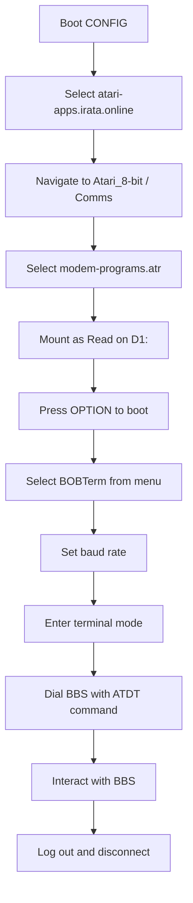

# Connecting to a BBS

FujiNet's built-in WiFi modem emulation allows your Atari to connect to bulletin board systems (BBSes) over the internet using standard Hayes-compatible AT commands. This guide walks you through connecting to a BBS step by step.

## Prerequisites

- An Atari computer with FujiNet connected and powered on
- A working WiFi connection configured in [CONFIG](../config/overview.md)
- A host slot pointed to `atari-apps.irata.online` (or another source for the modem programs disk)

## Connection Workflow



## Step-by-Step Guide

### 1. Load the Modem Programs Disk

1. Power on FujiNet and your Atari. Wait for CONFIG to boot.
2. Select the host slot for `atari-apps.irata.online`.
3. Navigate into the `Atari_8-bit` folder, then the `Comms` folder.
4. Select `modem-programs.atr`.
5. Ensure it is mounted as **R** (read-only) on **D1:**.
6. Press `OPTION` to boot.

### 2. Launch BOBTerm

1. Wait for the menu to appear after booting.
2. Select **1** for BOBTerm and wait for it to load.

### 3. Set the Baud Rate

1. Once BOBTerm is loaded, press `B` to cycle through baud rates.
2. Press `B` once to select **2400 baud**, or press `B` twice to select **4800 baud**.
3. Press `RETURN` to enter terminal mode.

> **Tip:** Most BBSes work well at 2400 or 4800 baud. Some may support higher speeds.

### 4. Test the Modem

Before dialing, verify that the modem emulation is working:

1. Type `AT` and press `RETURN`.
2. FujiNet should respond with `OK`.

If you do not see `OK`, check your WiFi connection and try again.

### 5. Dial a BBS

Use the `ATDT` command followed by the BBS hostname and optional port number:

```
ATDT hostname[:port]
```

For example:

```
ATDT southernamis.ddns.net
```

Or, to specify a port:

```
ATDT basementbbs.ddns.net:9000
```

FujiNet will attempt to connect. On success, you will see `CONNECT` followed by the baud rate, then the BBS login screen.

### 6. Interact with the BBS

- Follow the BBS prompts to log in. If you are a new user, the BBS will typically guide you through registration.
- Press `?` at the main prompt for a list of available commands.
- Explore message boards, file libraries, and online games.

### 7. Log Out

1. From the main BBS prompt, press `G` (or follow the BBS-specific logout instructions).
2. Complete the logout process.
3. FujiNet will display `NO CARRIER` once the connection is closed.

## Common AT Commands

| Command | Description |
|---------|-------------|
| `AT` | Test modem (should respond `OK`) |
| `ATDT host` | Dial a BBS by hostname |
| `ATDT host:port` | Dial a BBS on a specific port |
| `ATH` | Hang up (disconnect) |
| `ATCPM` | Start CP/M mode (see [CP/M guide](../cpm.md)) |

## Example BBSes

Here are some active BBSes you can connect to with FujiNet:

| BBS Name | Address | Notes |
|----------|---------|-------|
| Southern Amis | `southernamis.ddns.net` | Active Atari community BBS |
| Basement BBS | `basementbbs.ddns.net:9000` | Use port 9000 |

For a more comprehensive list of active Atari BBSes, visit [southernamis.com/atari-bbs-list](https://www.southernamis.com/atari-bbs-list).

## Troubleshooting

- **No response to AT command:** Ensure WiFi is connected. Reboot FujiNet and try again.
- **BUSY or NO CARRIER immediately:** The BBS may be offline or at capacity. Try a different BBS or wait and retry.
- **Garbled text:** Try a different baud rate. Press `B` in BOBTerm to cycle through available speeds.
- **Cannot find modem-programs.atr:** Verify your host slot is set to `atari-apps.irata.online` and navigate to the correct folder path.

## Further Reading

- [Deploying Your Own BBS](deploying.md)
- [More information on connecting to Atari BBSes](https://www.southernamis.com/how-to-connect)
