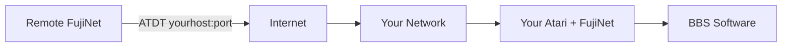

# Deploying Your Own BBS

With FujiNet's WiFi modem emulation, you can run a classic Atari BBS that is accessible to other FujiNet users over the internet. This guide provides an overview of what is involved in setting up and running your own BBS.

## How It Works

FujiNet emulates a Hayes-compatible modem, translating AT dial commands into TCP connections. BBS software running on your Atari sees FujiNet as a standard modem. Remote callers use `ATDT yourhost:port` from their own FujiNet to connect.

## BBS Software Packages

Several classic Atari BBS packages are available. Here are some of the most well-known options:

| Software | Description |
|----------|-------------|
| **FoReM XE/XL** | One of the most popular Atari BBS packages. Feature-rich with message bases, file libraries, and online games. |
| **BBS Express! Professional** | Full-featured BBS with a modular design. Supports message bases, file transfers, and customization. |
| **Carina BBS** | A more modern Atari BBS package with ANSI support and a clean interface. |
| **AMIS** | Atari Message Information System. A well-known Atari BBS platform. |

> **Note:** BBS software disk images can often be found on TNFS servers or in online Atari software archives.

## Requirements

To run a BBS with FujiNet, you will need:

- An Atari computer dedicated to running the BBS (it will be occupied full-time).
- A FujiNet device with a stable WiFi connection.
- BBS software configured for modem operation.
- A way for remote users to reach your Atari over the internet (see Network Setup below).

## Network Setup

For remote users to dial into your BBS, their FujiNet TCP connections need to reach your Atari:

1. **Static IP or Dynamic DNS:** Assign your machine a hostname using a dynamic DNS service (such as `ddns.net`) or use a static IP address.
2. **Port Forwarding:** Configure your router to forward the appropriate TCP port to the local machine running the BBS.
3. **Share your address:** Let other FujiNet users know your BBS hostname and port so they can connect with `ATDT yourhostname:port`.

## Tips for BBS Operators

- **Test locally first.** Use a second Atari with FujiNet on the same network to verify your BBS is working before opening it to the internet.
- **Choose a non-standard port** if port conflicts are a concern. Remote users can specify the port when dialing (e.g., `ATDT mybbs.example.com:9000`).
- **Keep your BBS software updated** with any available patches for stability.
- **Join the community.** The [FujiNet Discord](https://discord.gg/7MfFTvD) and the [Southern Amis Atari BBS list](https://www.southernamis.com/atari-bbs-list) are good places to announce your BBS and connect with other operators.

## Further Reading

- [Connecting to a BBS](connecting.md) -- guide for users who want to call into BBSes
- [CONFIG Application User Guide](../config/overview.md)
