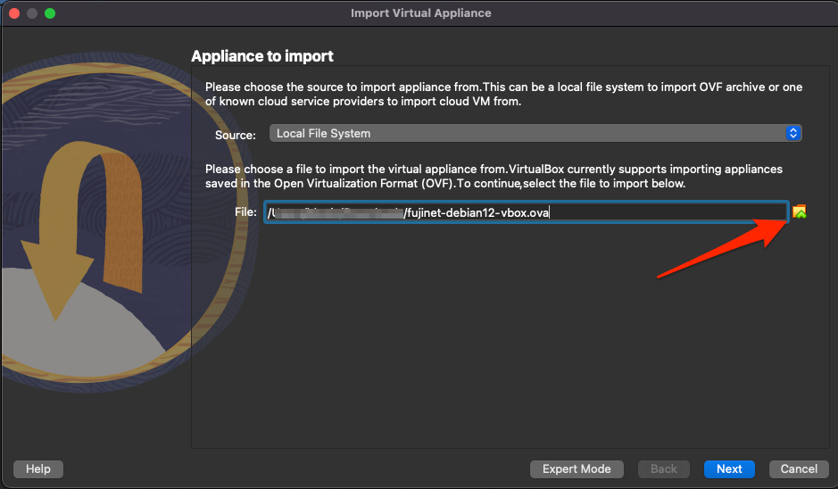
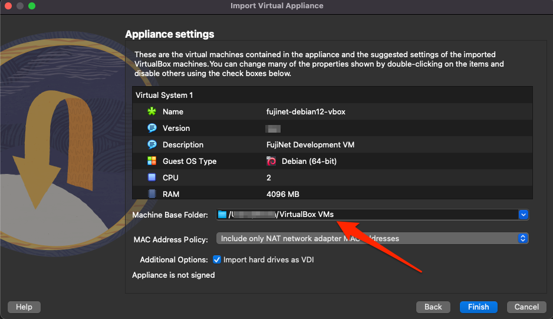

# FujiNet Virtual Machine

Using the FujiNet VirtualMachine makes it possible to try out a FujiNet device on the following platforms without having to purchase any hardware:

- Atari
- Apple II
- Tandy CoCo

## VM Features

The VM is built as a VirtualBox OVA appliance file which should be able to be importad into VirtualBox version 6 or 7. The VM includes the following functionality currently:

- Debian 12 Linux with the XFCE 4 desktop environment
- Altirra Atari emulator installed & run via Wine (Desktop Launcher)
- AppleWin Apple II emulator installed using native Linux port (Desktop Launcher)
- FujiNet PC for Atari plus netsio bridge emulator for connecting Altirra to the virtual FujiNet (starts automatically)
- FujiNet PC for Apple for connecting AppleWin to the virtual FujiNet (starts automatically)
- Epiphany web browser for connecting to the virtual FujiNet device's web UI
- Download the VM
- The latest build of the VM can be [downloaded here](https://mega.nz/folder/4L03hKRL#L1GOblpv8xbHROaKIPb1xg) (~3.6GB file)

## Importing the VM

The easiest way to import the OVA into VirtualBox is by using the GUI:

1. From the File menu, select Import Appliance...
1. Select the OVA file that was downloaded & click `Next`

    

1. Optionally change the Machine Base Folder on the following page to where you'd like to store the imported VM. Most other items on this page are just informational & can be left as is.

    

1. Click Finish & wait for the VM to be imported

Once the VM has been imported the various settings can be customized to your liking. However, the VM should work without any modifications. If more memory is available it will make a noticeable performance difference to increase the VM's allotted RAM as much as possible.

## Additional Documentation

[Official FujiNet VirtualMachine documentation](https://fujinet-vm.readthedocs.io/) is available with more in-depth help & usage information.