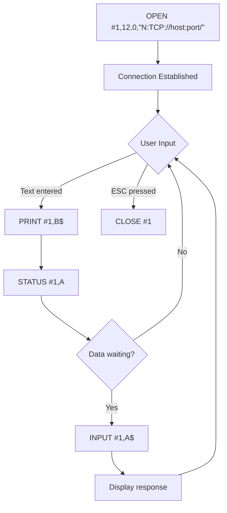

# BASIC Programming with the N: Device

The N: device is a standard CIO device, which means it can be used directly from Atari BASIC and other platform BASICs. Once the NDEV handler is loaded, you can load and save programs, read and write data files, and open direct connections to TCP and UDP sockets -- all from BASIC.

## Prerequisites

Before using the N: device from BASIC, ensure:

1. The **NDEV handler** is loaded (you should see `FUJINET READY` at boot)
2. Your **FujiNet is connected** to WiFi
3. You are in **BASIC** (not the DOS menu)

For details on loading the handler, see the [N: Device Overview](overview.md#loading-the-n-device-handler).

## Loading BASIC Programs

The simplest way to use the N: device is to load and run BASIC programs directly from the network.

### Using a Full Devicespec

```basic
RUN "N:HTTP://ATARI-APPS.IRATA.ONLINE/BLACKJACK.BAS"
```

This downloads `BLACKJACK.BAS` over HTTP and runs it immediately. BASIC supports devicespecs up to **128 characters** in length, so most URLs will fit without issue.

### Using a Directory Prefix

For repeated access to the same server, set a directory prefix first using XIO call 44. This matches the same call used by MyDOS and SpartaDOS and works regardless of which DOS is loaded:

```basic
XIO 44,#1,0,0,"N:HTTP://ATARI-APPS.IRATA.ONLINE/"
RUN "N:BLACKJACK.BAS"
```

The prefix `HTTP://ATARI-APPS.IRATA.ONLINE/` is automatically prepended, so `N:BLACKJACK.BAS` resolves to the full URL.

You can also use the [NCD tool](tools.md#ncd) to set the prefix before entering BASIC.

## Saving BASIC Programs

Save programs to network file systems the same way you would save to disk:

### Direct Save

```basic
SAVE "N:TNFS://HOMESERVER/PEWPEW.BAS"
```

### Save with Prefix

```basic
XIO 44,#1,0,0,"N:TNFS://HOMESERVER/"
SAVE "N:PEWPEW.BAS"
```

## File I/O Operations

Since the N: device exposes a full CIO interface, you can use all standard BASIC I/O commands to interact with network resources.

### Reading a File

```basic
10 REM -- Read a file from a web server
20 OPEN #1,4,0,"N:HTTP://EXAMPLE.COM/DATA.TXT"
30 TRAP 100
40 INPUT #1,A$
50 PRINT A$
60 GOTO 40
100 CLOSE #1
```

| Line | Purpose |
|------|---------|
| 20 | Open the URL for reading (aux1=4 means read mode) |
| 30 | Set TRAP to jump to line 100 on EOF or error |
| 40 | Read a line of text from the network |
| 50 | Print the line to the screen |
| 60 | Loop to read the next line |
| 100 | Close the connection when done |

### Writing a File

```basic
10 REM -- Write data to a TNFS server
20 OPEN #1,8,0,"N:TNFS://HOMESERVER/OUTPUT.TXT"
30 PRINT #1,"Hello from Atari BASIC!"
40 PRINT #1,"Written via FujiNet N: device"
50 CLOSE #1
```

| Line | Purpose |
|------|---------|
| 20 | Open the file for writing (aux1=8 means write mode) |
| 30-40 | Write lines of text to the network file |
| 50 | Close the connection and flush the data |

### Read/Write Mode

Open a channel for both reading and writing by setting aux1 to 12:

```basic
OPEN #1,12,0,"N:TCP://192.168.1.8:2000/"
```

## TCP Socket Communication

The N: device allows BASIC programs to communicate directly over TCP sockets. This enables everything from simple chat clients to BBS terminal programs.

### Simple TCP Client

```basic
10 REM -- Simple TCP echo client
20 DIM A$(256),B$(256)
30 OPEN #1,12,0,"N:TCP://192.168.1.100:6502/"
40 PRINT "Connected! Type text to send."
50 PRINT "Press RETURN to send, ESC to quit."
60 REM -- Main loop
70 TRAP 200
80 INPUT B$
90 IF B$="" THEN 80
100 PRINT #1,B$
110 REM -- Check for response
120 STATUS #1,A
130 IF A=0 THEN 80
140 INPUT #1,A$
150 PRINT "Received: ";A$
160 GOTO 80
200 CLOSE #1
210 PRINT "Disconnected."
```

### Connection Flow



## UDP Communication

UDP is useful for sending small, quick messages -- for example, in multiplayer game scenarios.

### Sending UDP Packets

```basic
10 REM -- Send UDP data to another FujiNet
20 OPEN #1,8,0,"N:UDP://192.168.1.50:5000/"
30 PRINT #1,"HELLO FROM PLAYER 1"
40 CLOSE #1
```

### Receiving UDP Packets

```basic
10 REM -- Listen for UDP packets
20 OPEN #1,4,0,"N:UDP://:5000/"
30 TRAP 100
40 STATUS #1,A
50 IF A=0 THEN 40
60 INPUT #1,A$
70 PRINT "Received: ";A$
80 GOTO 40
100 CLOSE #1
```

## Working with HTTP

### Downloading Data from a REST API

```basic
10 REM -- Fetch data from an HTTP API
20 DIM A$(256)
30 OPEN #1,4,0,"N:HTTP://API.EXAMPLE.COM/TIME"
40 TRAP 100
50 INPUT #1,A$
60 PRINT A$
70 GOTO 50
100 CLOSE #1
```

### Downloading a Binary File

For binary files, use GET instead of INPUT to read raw bytes:

```basic
10 REM -- Download a binary file via HTTP
20 REM -- and save it to disk
30 OPEN #1,4,0,"N:HTTP://SERVER/GAME.COM"
40 OPEN #2,8,0,"D1:GAME.COM"
50 TRAP 200
60 STATUS #1,A
70 IF A=0 THEN 200
80 GET #1,B
90 PUT #2,B
100 GOTO 60
200 CLOSE #1
210 CLOSE #2
220 PRINT "Download complete."
```

## IOCB Open Modes Reference

The `aux1` parameter in the OPEN statement controls the access mode:

| aux1 Value | Mode | Description |
|------------|------|-------------|
| 4 | Read | Open for reading only |
| 8 | Write | Open for writing only |
| 12 | Read/Write | Open for both reading and writing |

## Common Patterns

### Error Handling with TRAP

Always use TRAP to handle end-of-file and network errors gracefully:

```basic
30 TRAP 100
...
100 REM -- Error/EOF handler
110 CLOSE #1
120 IF PEEK(195)=136 THEN PRINT "END OF FILE"
130 IF PEEK(195)=138 THEN PRINT "TIMEOUT"
140 IF PEEK(195)=200 THEN PRINT "CONNECTION REFUSED"
```

### Checking Connection Status

Use `STATUS` to check how many bytes are waiting before reading:

```basic
STATUS #1,A
IF A>0 THEN INPUT #1,A$
```

### Setting the Directory Prefix from BASIC

Use XIO 44 to set the N: device prefix without leaving BASIC:

```basic
XIO 44,#1,0,0,"N:HTTP://MY.SERVER.COM/FILES/"
```

This is equivalent to running the [NCD tool](tools.md#ncd) from DOS.

## Tips and Best Practices

| Tip | Details |
|-----|---------|
| Use prefixes | Set a prefix with XIO 44 to avoid typing long URLs repeatedly |
| Check STATUS before reading | Avoid reading when no data is available |
| Always CLOSE channels | Unclosed connections consume resources on FujiNet |
| Use TRAP for error handling | Network operations can fail; always have a TRAP handler |
| Use appropriate open mode | Read-only (4) for downloads, write (8) for uploads, read/write (12) for sockets |
| Mind the 128-char limit | BASIC devicespecs are limited to 128 characters; use prefixes for long paths |

## Next Steps

- [N: Device Overview](overview.md) -- high-level introduction
- [Supported Protocols](protocols.md) -- detailed protocol reference
- [Tools and Utilities](tools.md) -- NCD, NCOPY, and other tools
