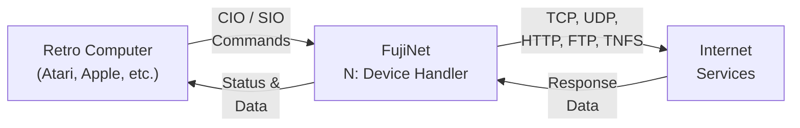
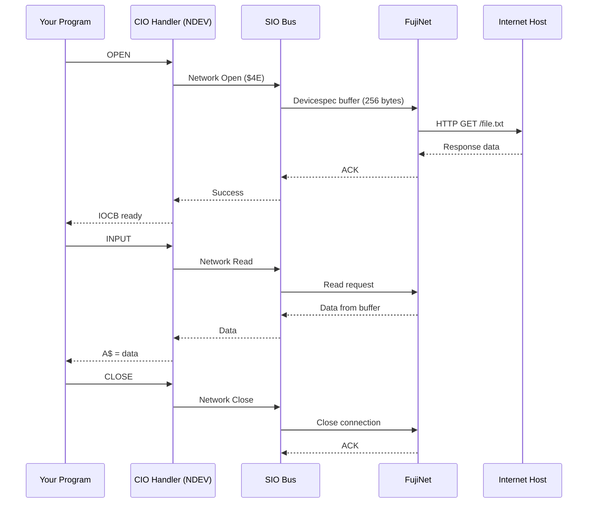

# N: Device Overview

The **N: device** is FujiNet's network device, providing your retro computer with direct access to the internet through a familiar device interface. Just as `D:` accesses disk drives and `P:` accesses the printer, `N:` gives programs the ability to communicate over the network using standard I/O operations.

## What Is the N: Device?

The N: device is a virtual CIO (Central Input/Output) device implemented by FujiNet. It allows programs to open network connections, read and write data over the internet, and interact with remote file systems -- all using the same I/O calls they would use for local devices like disk drives.

This means that existing programs can be adapted to use network resources with minimal changes, and new programs can leverage network capabilities through a well-understood interface.

## Supported Protocols

The N: device supports a variety of network protocols:

| Protocol | Description | Typical Use |
|----------|-------------|-------------|
| **TCP** | Transmission Control Protocol | Telnet, BBS connections, raw sockets |
| **UDP** | User Datagram Protocol | Multiplayer games, lightweight messaging |
| **HTTP/HTTPS** | HyperText Transfer Protocol | Web downloads, REST APIs, file retrieval |
| **FTP** | File Transfer Protocol | Browsing and transferring files on FTP servers |
| **TNFS** | Trivial Network File System | Accessing files on TNFS servers |

## How It Works

The N: device acts as a bridge between your retro computer and the internet. Your program issues standard I/O calls to the N: device, FujiNet translates those into the appropriate network protocol operations, and the results are passed back to your program.



### Data Flow in Detail

1. **Your program** issues a standard OPEN, READ, WRITE, or CLOSE call to the N: device with a URL-like devicespec.
2. **The N: device handler** (loaded into memory on your retro computer) translates this into an SIO command and sends it to FujiNet.
3. **FujiNet** parses the devicespec, determines the protocol, and performs the actual network communication over WiFi.
4. **Response data** flows back through FujiNet to the N: device handler and into your program's I/O buffer.



## The N: Devicespec

All N: device operations use a URL-like devicespec to identify the network resource:

```
N[x]:<PROTO>://<PATH>[:PORT]/
```

| Component | Required | Description |
|-----------|----------|-------------|
| `N` | Yes | The device identifier |
| `x` | No | Unit number (1-4). Defaults to 1 if omitted |
| `PROTO` | Yes | Protocol: TCP, UDP, HTTP, HTTPS, FTP, or TNFS |
| `PATH` | Yes | Host and resource path, specific to the protocol |
| `PORT` | No | Port number (1-65535). Protocol default used if omitted |

### Examples

| Devicespec | What It Does |
|------------|-------------|
| `N:HTTP://example.com/file.txt` | Retrieve a file over HTTP |
| `N:TCP://bbs.example.com:23/` | Open a TCP connection to a BBS |
| `N:FTP://ftp.example.com/pub/game.atr` | Download a file via FTP |
| `N:TNFS://myserver/games/` | Access a directory on a TNFS server |
| `N2:UDP://192.168.1.100:5000/` | Open a UDP socket on unit 2 |

## Directory Prefix

The N: device supports a **directory prefix** (or "current directory") that is automatically prepended to any devicespec you provide. This saves typing when working with a particular server or directory.

For example, if the prefix is set to `HTTP://atari-apps.irata.online/`, then opening `N:BLACKJACK.BAS` automatically resolves to `N:HTTP://atari-apps.irata.online/BLACKJACK.BAS`.

The prefix can be set with the [NCD tool](tools.md#ncd) or via XIO call 44 from BASIC.

## Loading the N: Device Handler

Before your retro computer can use the N: device, the **NDEV handler** must be loaded into memory. This handler is included on the fnc-tools disk as `NDEV.COM`.

To load it automatically at boot, rename it appropriately for your DOS:

| DOS | Filename |
|-----|----------|
| DOS 2.5 / DOS XL | `AUTORUN.SYS` |
| MyDOS | `AUTORUN.AR0` |
| XDOS / LiteDOS | `AUTORUN.AU0` |

Pre-configured DOS disks with the N: device handler are available on the TNFS server at `apps.irata.online/Atari_8-Bit/DOS/`.

When the handler loads successfully, you will see:

```
FUJINET READY
```

## Quick Smoke Test

To verify the N: device is working, try loading a BASIC program from the network:

```
RUN "N:HTTP://FUJINET-TESTING.IRATA.ONLINE/BLACKJACK.BAS"
```

If everything is working, a Blackjack game will load and run. If you encounter errors, see the table below:

| Error | Meaning |
|-------|---------|
| `ERROR- 130` | N: device handler is not loaded. Ensure NDEV is in memory. |
| `ERROR- 138` | Network timeout. Check your FujiNet WiFi connection. |
| Other errors | Check the [error codes reference](../error_codes.md) or ask the FujiNet team. |

## Next Steps

- [Supported Protocols](protocols.md) -- detailed guide to each protocol and its URL format
- [Tools and Utilities](tools.md) -- NCD, NCOPY, NDEL, and other N: device tools
- [BASIC Programming Examples](basic_usage.md) -- using the N: device from BASIC
