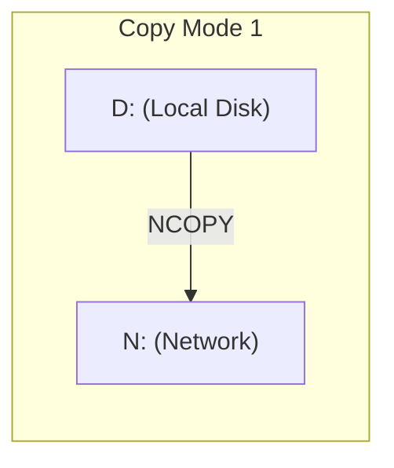
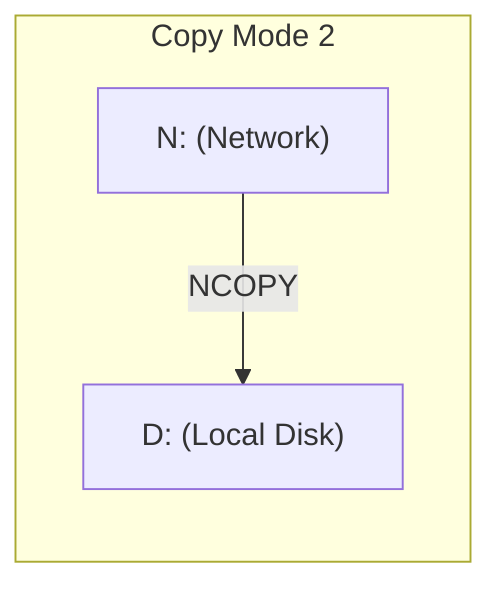
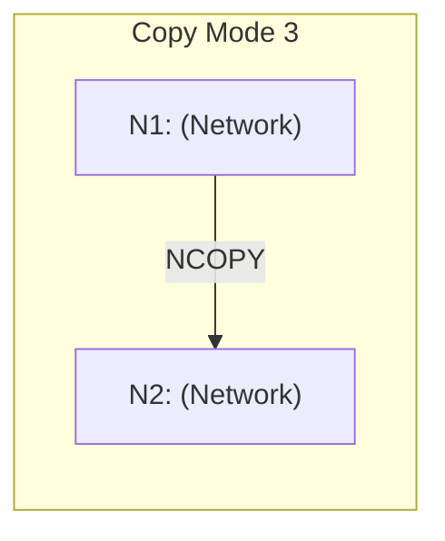
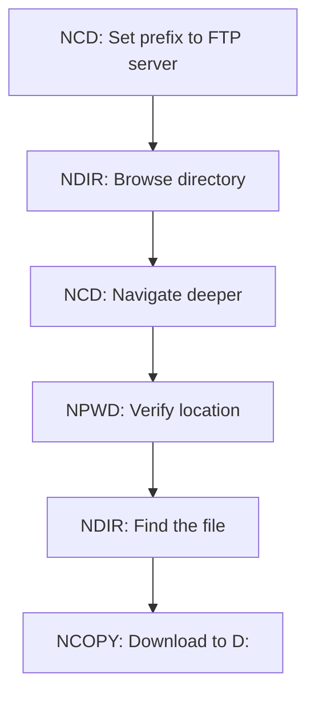

# N: Device Tools and Utilities

FujiNet provides a suite of command-line tools for working with the N: device. These tools are distributed on the **fnc-tools.atr** disk image, available from fujinet.online.

A key advantage of these tools is that they communicate directly with FujiNet over SIO, so **the NDEV handler does not need to be loaded** for them to work. Each tool also includes a corresponding `.DOC` file with detailed usage information.

## Tools Overview

| Tool | Purpose |
|------|---------|
| [NCD](#ncd) | Change the N: device directory prefix |
| [NPWD](#npwd) | Display the current directory prefix |
| [NDIR](#ndir) | List directory contents from a network resource |
| [NCOPY](#ncopy) | Copy files between N: devices and local drives |
| [NDEL](#ndel) | Delete files on network resources |
| [NREN](#nren) | Rename files on network resources |

All tools work with both menu-based DOSes (such as Atari DOS 2.5 and MyDOS) and CLI-based DOSes (such as DOS XL and SpartaDOS). When run from a menu-based DOS, parameters are requested interactively. When run from a CLI, parameters can be passed on the command line.

If `N:` is not specified or no unit number is given, **N1:** is assumed by default.

## NCD

**NCD** (Network Change Directory) sets the directory prefix for an N: device. The prefix is automatically prepended to any devicespec you use, saving significant typing when working within a particular server or directory tree.

### Usage

```
NCD [N[x]:][PROTO:]//[HOST][:PORT]/[PATH]
```

All parameters are optional. If no arguments are given, the directory prefix is cleared.

### Examples

Set a prefix to an FTP server:

```
NCD N:FTP://FTP.PIGWA.NET/stuff/collections/
```

Set a prefix to an HTTP server:

```
NCD N:HTTP://ATARI-APPS.IRATA.ONLINE/
```

Clear the prefix:

```
NCD
```

### Relative Navigation

NCD supports relative path navigation, making it easy to browse directory trees:

| Command | Action |
|---------|--------|
| `NCD N:games/` | Append `games/` to the current prefix |
| `NCD /` | Reset to the root directory (keeps protocol, host, port) |
| `NCD ..` | Move up one directory level |

### Mapping Directly to a File

You can set the prefix to point directly to a specific file. This is useful for programs that only accept simple devicespecs:

```
NCD N:FTP://FTP.PIGWA.NET/stuff/collections/games/FROG.EXE
```

Now `N:` points directly to FROG.EXE, and you can use simple copy commands:

```
COPY N: D1:FROG.COM
```

### Directories vs. Files

End directory names with `/` to indicate they are directories:

```
N:FTP://SERVER/stuff/games/       This is a directory
N:FTP://SERVER/welcome.msg        This is a file
```

If you accidentally specify a directory as a file, use `NCD ..` to back out.

## NPWD

**NPWD** (Network Print Working Directory) displays the current directory prefix for an N: device.

### Usage

```
NPWD [N[x]:]
```

### Examples

```
D1:NPWD N:
FTP://FTP.PIGWA.NET/stuff/collections/
```

If no prefix is set:

```
D1:NPWD N:
NO PREFIX SET
```

## NDIR

**NDIR** (Network Directory) retrieves and displays a directory listing from a network file system.

### Usage

```
NDIR [N[x]:]<devicespec>
```

If a filename is not specified, the wildcard `*` is assumed. If no parameters are given, interactive mode prompts for the path.

### Examples

List the root of an FTP server:

```
D1:NDIR N:FTP://FTP.PIGWA.NET/
Changelog.html
lost+found
stuff
upload
upload2
welcome.msg
```

List using the current prefix:

```
D1:NCD N:FTP://FTP.PIGWA.NET/stuff/
D1:NDIR N:
collections
docs
utils
```

## NCOPY

**NCOPY** (Network Copy) copies files between network resources and local devices. It supports three copy modes and transfers data in efficient **16 KB chunks** for better performance.

### Usage

```
NCOPY <FROM>,<TO>
```

If parameters are not specified, NCOPY prompts:

```
NET COPY--FROM, TO?
```

### Copy Modes







#### Local to Network

```
D1:FROG.EXE,N:TNFS://HOMESERVER/GAMES/FROG.EXE
```

#### Network to Local

With the prefix set to an FTP path:

```
N:FROG.EXE,D1:FROG.EXE
```

#### Network to Network

Using two different N: units with different prefixes:

```
NCD N1:FTP://FTP.PIGWA.NET/pub/collections/games/
NCD N2:HTTP://MYHOMESERVER/games/
NCOPY N1:FROG.EXE,N2:FROG.EXE
```

### Notes

- Both FROM and TO must be valid devicespecs. For N: devices, the directory prefix is used.
- Wildcards are **not currently supported** but are planned for a future release.
- NDEV does not need to be loaded in memory.

## NDEL

**NDEL** (Network Delete) deletes files from network resources.

### Usage

```
NDEL [N[x]:]<devicespec>
```

If no parameter is given, one is prompted for interactively.

### Example

```
NDEL N:HTTP://HOMESERVER/BLAH.TXT
```

> **Warning:** Unlike DOS, NDEL does **not** prompt for confirmation before deleting. Use with care.

## NREN

**NREN** (Network Rename) renames a file on a network file system. The old and new filenames are separated by a comma.

### Usage

```
NREN [N[x]:]<OLD>,<NEW>
```

### Example

```
D1:NREN N1:TNFS://TMA-1/FOO.TXT,BAR.TXT
```

This renames `FOO.TXT` to `BAR.TXT` on the TNFS server `TMA-1`.

## Practical Workflow Example

Here is a typical workflow combining multiple tools to browse an FTP archive and download a file:

```
REM Step 1: Set the prefix to an FTP server
NCD N:FTP://FTP.PIGWA.NET/

REM Step 2: See what's available
NDIR N:

REM Step 3: Navigate into a subdirectory
NCD N:stuff/collections/

REM Step 4: Check our current location
NPWD N:

REM Step 5: List the contents
NDIR N:

REM Step 6: Copy a file to local disk
NCOPY N:GAME.COM,D1:GAME.COM
```



## Next Steps

- [N: Device Overview](overview.md) -- high-level introduction to the N: device
- [Supported Protocols](protocols.md) -- detailed protocol reference
- [BASIC Programming Examples](basic_usage.md) -- using the N: device from BASIC
