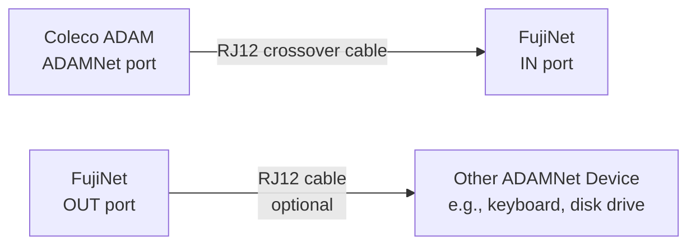

# Coleco ADAM Quickstart Guide

Welcome to the FujiNet quickstart guide for the Coleco ADAM. This guide covers hardware setup, WiFi configuration, and getting started with disk images. For a broader overview of all supported platforms, see the [Platform Overview](../platform_overview.md).

---

## Getting to Know Your FujiNet

The ADAM FujiNet connects to your Coleco ADAM via the ADAMNet bus using standard RJ12 cables.

### Physical Layout

| Location | Feature | Details |
|----------|---------|---------|
| **Left side** | Power switch | Pull forward = On, push back = Off |
| **Right side** | Micro-SD card slot | Push/push socket for local storage |
| **Top** | 3 status LEDs | WiFi, Bluetooth, and ADAMNet activity |
| **Top** | 3 buttons | Left, Middle, and Right (see [Buttons](#buttons) below) |
| **Back** | 2 RJ12 jacks | ADAMNet IN and OUT (labeled on top) |
| **Back** | Micro USB port | Firmware updates and serial debug output |

### Micro-SD Card

The SD card must be formatted **FAT32**. The exFAT format is not supported.

### LED Indicators

| LED (left to right) | Color | Meaning |
|----------------------|-------|---------|
| Left | White | WiFi connected |
| Middle | Blue | Bluetooth connected (currently inactive in firmware) |
| Right | Yellow | ADAMNet activity |

### Buttons

All three buttons support short press, long press, and double-tap. Current assignments:

| Button | Action | Function |
|--------|--------|----------|
| **Right** | Short press | FujiNet reset |

> **Note:** Additional button functions for Left and Middle buttons are still to be determined. Check the [FujiNet Discord](https://discord.gg/7MfFTvD) for the latest updates.

---

## Available Hardware

Several ADAM FujiNet devices are available from community makers. Check the [FujiNet Discord](https://discord.gg/7MfFTvD) for the most current list of producers and availability.

---

## Connecting Your FujiNet

FujiNet is powered directly from the ADAMNet bus -- no external power is required.

### Connection Steps

1. Connect an ADAMNet cable (RJ12 6P6C crossover) from the FujiNet **IN** port to an ADAMNet port on your Coleco ADAM.
2. Optionally connect another ADAMNet device (keyboard, disk drive, etc.) to the **OUT** port on FujiNet with another ADAMNet cable.
3. Turn on the FujiNet power switch (pull forward).

### Power Options

| Power Source | Behavior |
|-------------|----------|
| ADAMNet bus (default) | FujiNet powers on/off with the ADAM; power switch controls state |
| External Micro USB | Power switch is bypassed; FujiNet stays powered as long as USB is connected |

The Micro USB port also provides:
- A connection for [firmware updates](#updating-firmware)
- Serial debug output to a computer's serial monitor

---

## First Boot

When you turn on the ADAM with FujiNet connected, the system will first attempt to boot SmartWriter (or another disk/drive if available). This happens because FujiNet is not fast enough to be fully ready before the ADAM completes its initial boot sequence.

### Workarounds for Boot Timing

| Method | Steps |
|--------|-------|
| **Hold reset** | Hold the ADAM reset button for a few seconds while turning it on, giving FujiNet time to start up, then release reset |
| **External USB power** | Power FujiNet from the Micro USB port so it is already running when the ADAM powers on |

### WiFi Configuration

On first boot (or when the saved WiFi access point is unavailable), FujiNet will prompt you to set up a wireless connection:

1. The CONFIG program loads automatically from FujiNet.
2. Select your WiFi access point from the list.
3. Enter the access point passphrase.
4. FujiNet connects and presents the main CONFIG screen.

> **Important:** FujiNet uses the Espressif ESP32 chipset, which operates on **2.4 GHz WiFi only**. If you use a dual-band (2.4/5 GHz) router with a shared SSID, you may experience connectivity issues. Consider setting up a dedicated 2.4 GHz SSID if problems arise.

---

## Navigating CONFIG

CONFIG is designed to be intuitive and reminiscent of ADAM programs like SmartWriter.

### Main Screen Layout

The main screen displays:
- **Host slots** (top) -- sources for disk images
- **Disk slots** (bottom) -- virtual drives available to the ADAM

Press **Tab** to jump between host slots and disk slots.

### Host Slots

Host slots define where your disk images are stored. Each slot can contain:

| Entry | Description |
|-------|-------------|
| Hostname or IP (e.g., `adam-apps.irata.online`) | TNFS server address |
| `SD` | The onboard Micro-SD card |
| *(blank)* | Empty slot |

With a host slot selected:
- Press **Return** to browse and select disk images from that host
- Press **V** to edit the host slot entry

### Mounting and Booting

1. Select a host slot and press **Return** to browse available disk images.
2. Choose a disk image and select which drive slot to mount it in.
3. Choose read-only or read/write access.
4. Return to the main CONFIG screen and reboot to use your mounted disks.

---

## Web User Interface

FujiNet provides a built-in web-based configuration interface accessible from any browser on the same network.

### Finding Your FujiNet's IP Address

| Method | How |
|--------|-----|
| CONFIG screen | Press **IV** (Show Config) from the main CONFIG screen |
| Router admin | Look for the hostname "FujiNet" in your router's connected devices list |
| Default hostname | Navigate to [http://fujinet.local](http://fujinet.local) |

Once you have the IP address, visit `http://<IP_ADDRESS>/` in your browser (for example, `http://192.168.0.123/`).

---

## Updating Firmware

Download the FujiNet-Flasher application (available for Windows, macOS, and Linux) from [fujinet.online/download](https://fujinet.online/download/).

Connect FujiNet to your computer via the Micro USB port on the back and follow the flasher's instructions.

For more information, see the [FujiNet-Flasher documentation](https://github.com/FujiNetWIFI/fujinet-platformio/wiki/FujiNet-Flasher).

---

## Further Reading

- [Platform Overview](../platform_overview.md) for a summary of all supported platforms
- [User FAQ](https://fujinet.online/user-faq/) at fujinet.online
- Join the [FujiNet Discord](https://discord.gg/7MfFTvD) community for real-time support and the latest hardware availability
