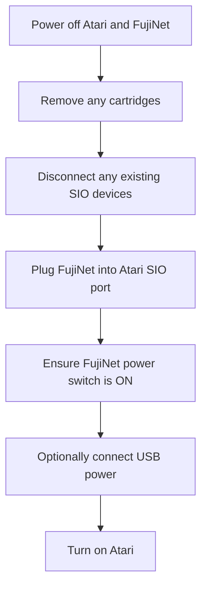
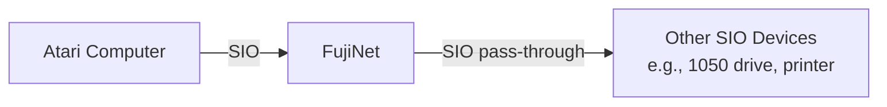

# Atari 8-bit Quickstart Guide

Welcome to the FujiNet quickstart guide for the Atari 8-bit computer family. This guide covers initial setup, WiFi configuration, and basic disk image mounting. For a broader overview of what FujiNet can do across all platforms, see the [Platform Overview](../platform_overview.md).

---

## Getting to Know Your FujiNet

With the SIO plug (which connects to your Atari) facing you, the FujiNet hardware is laid out as follows:

### Physical Layout

| Location | Feature | Details |
|----------|---------|---------|
| **Top left** | Buttons A and B | Disk swap, debug, safe reset (see [Buttons](#buttons) below) |
| **Top right** | Reset button | Returns to CONFIG on next reboot |
| **Left side** | Micro USB or USB-C port | Power and serial debugging |
| **Left side** | Power switch | Down = Off, Up = On |
| **Right side** | Micro-SD card slot | Local storage for disk images and configuration |
| **Front** | SIO plug | Connects to your Atari |
| **Back** | SIO receptacle | Daisy-chain other SIO devices |

### Micro-SD Card

The Micro-SD card slot uses a tension-mounted (not spring-loaded) mechanism. Insert the card with the metal contacts facing toward the Atari (toward the SIO plug).

> **Important:** The Micro-SD card **must** be formatted as FAT32. Cards of 32 GB or smaller are recommended, as larger cards have been reported to cause issues. A 2 GB card is more than sufficient for most use cases.

### LED Indicators

| LED (left to right) | Color | Meaning |
|----------------------|-------|---------|
| Left | White | WiFi enabled |
| Middle | Blue | Bluetooth enabled |
| Right | Orange | SIO activity |

### Buttons

| Button | Action | Function |
|--------|--------|----------|
| **A** | Tap | Disk swap |
| **A** | Hold | Toggle SIO2BT mode (requires SIO2BT firmware) |
| **B** | Tap | Print debug info to serial console |
| **B** | Hold | Safe reset (unmounts SD card before reboot) |
| **B** | Hold on power-up | Reset FujiNet configuration |
| **Reset** | Press | On next Atari reboot, return to CONFIG instead of booting the disk in slot 1 |

---

## Connecting Your FujiNet

Follow these steps to connect FujiNet to your Atari for the first time:

1. Start with your Atari computer and FujiNet both **powered off**.
2. Remove any cartridges from your Atari's cartridge slot.
3. Remove any SIO cable or device currently connected to your Atari's SIO peripheral port.
4. Plug the FujiNet firmly into your Atari's SIO peripheral port.
5. For now, do not plug anything into the FujiNet's SIO receptacle (back port).
6. Optionally, provide power to the FujiNet via a USB cable.
7. Make sure the FujiNet's power switch is in the "On" position (up).

> **Note -- Atari 400/800 Users:** The Atari 400/800 (or XL/XE systems running the 800 OS) currently require external USB power for FujiNet, because FujiNet does not come online fast enough from SIO bus power alone. A workaround: power on the 800 while holding **Start** (to attempt a cassette boot), wait for FujiNet to fully power up, then press **Reset** to reboot into CONFIG.

> **Note -- Persistent Mounts:** If you connect external USB power to your FujiNet, it will keep settings active (such as mounted disks) even when the Atari is powered off. This is useful if you need to keep disks mounted between boots.

---

## Boot Up and Connect to WiFi

1. Turn on your Atari computer.
2. FujiNet will begin responding as disk drive #1. The rightmost (orange) LED will blink, and you should hear SIO activity beeping from your TV or monitor speaker.
3. The **FujiNet CONFIG** program will appear on screen.
4. Choose your WiFi network from the list, or select `<Enter a specific SSID>` to type it manually. Press **Esc** to rescan for networks.
5. Enter your WiFi network password, if required.
6. If the password is correct, you will see the "Connected to Network" confirmation screen.
7. Once connected, the Host and Slot screen will appear, and you are ready to mount disk images.

> **Important:** FujiNet uses the Espressif ESP32 chipset, which operates on **2.4 GHz WiFi only**. If you use a dual-band (2.4/5 GHz) router with a shared SSID, you may experience connectivity issues. Symptoms include inability to ping the FujiNet, connect to TNFS servers, or reach the web interface. Consider setting up a dedicated 2.4 GHz SSID if problems arise.

---

## How Booting Works

When you turn on (or reboot) your Atari, it searches for devices on the SIO bus. Any device responding as "disk drive #1" (`D1:`) will be used for booting -- whether that is a real floppy drive, a virtual drive (SIO2SD, SDriveMax), or FujiNet.

When FujiNet is connected and powered on, if **no other device** responds as `D1:` after a moment, FujiNet will respond. It will either boot the disk image mounted in its drive slot 1, or load the CONFIG program.

| Scenario | Result |
|----------|--------|
| No disk in slot 1, no other D1 device | FujiNet boots into CONFIG |
| Disk image in slot 1, no other D1 device | FujiNet boots the mounted disk image |
| Another device responds as D1 | That device boots; FujiNet provides other drive slots |
| Hold **Select** during boot | FujiNet skips auto-WiFi, allowing you to reconfigure the network |

---

## Navigating CONFIG

After initial WiFi setup, booting into CONFIG displays the main screen with two sections:

- **TNFS Host List** (top) -- sources for disk images
- **Drive Slots** (bottom) -- virtual floppy drives seen by the Atari as `D1:` through `D8:`

Each section has 8 entries. Use the arrow keys, joystick up/down, or the **1** through **8** keys to move between entries. Press **Tab** to switch between the host list and drive slots.

### TNFS Host List

Press **E** to edit a host slot. Enter one of the following:

| Entry | Description |
|-------|-------------|
| `SD` | Access files on the inserted Micro-SD card |
| Hostname (e.g., `fujinet.online`) | Connect to a TNFS server |
| IP address | Connect to a TNFS server by IP |
| *(blank)* | Leave the slot empty |

Press **Return** or joystick **Fire** on a host to browse its files and directories.

### Drive Slots

Each drive slot displays (from left to right):

- The host number the disk image came from
- The drive slot number (1-8, corresponding to `D1:` through `D8:`)
- Read-only (`R`) or read/write (`W`) status
- The path and filename of the mounted disk image

Press **E** to eject (unmount) a disk image from the selected slot.

### Browsing Disk Images

When browsing a host's files:

| Key | Action |
|-----|--------|
| Arrow keys / joystick | Navigate files and directories |
| **Return** / **Fire** | Select a disk image or enter a subdirectory |
| **>** | Next page of files |
| **<** | Previous page of files |
| **Delete/Backspace** | Go up to parent directory |
| **F** | Filter files (e.g., `star*` to find Star Raiders, Star Trek, etc.) |
| **N** | Create a new blank disk image (.atr file) |
| **Esc** | Return to main CONFIG screen |

### Mounting a Disk Image

After selecting a disk image, you will see the list of drive slots 1 through 8:

1. Use the arrow keys, joystick, or number keys (**1**-**8**) to select a slot.
2. Press **Return** or joystick **Fire** to mount the image.
3. Choose read-only (press **Return** or **R**) or read/write (press **W**).
4. Press **Esc** at any time to abort.

### Booting Your Software

Once your drive slots are configured:

1. Press the **Option** key to reboot your Atari.
2. If your Atari has built-in BASIC and the software requires BASIC to be disabled, hold **Option** as the Atari begins to boot.
3. Your mounted disk images will persist across reboots.
4. To return to CONFIG on the next reboot, press the **Reset** button on the FujiNet.

### General CONFIG Controls

| Key | Action |
|-----|--------|
| **Option** | Reboot the Atari |
| **C** | Show FujiNet configuration (WiFi details, IP address) |
| **S** (from config screen) | Change WiFi SSID |
| **Tab** | Switch between host list and drive slots |

---

## Using FujiNet with Other Devices

FujiNet has a pass-through SIO receptacle on the back, so you can daisy-chain other SIO devices.

You do not need to mount disk images on all FujiNet slots. Mix and match with real floppy drives or other virtual drives as needed:

| Scenario | How It Works |
|----------|--------------|
| Boot from another drive, ignore FujiNet | If another device responds as D1, it boots normally. You can also switch FujiNet off. |
| Boot from another drive, use FujiNet for extra slots | Your other device handles D1; FujiNet provides D2-D8. |
| Boot from FujiNet, access other drives too | Ensure no other device claims D1. FujiNet boots, and other drives use their assigned slots. |

---

## Using FujiNet with Cartridge Software

FujiNet can appear as a cassette drive, floppy drives, printers, and other peripherals to your Atari. Cartridge-based software that accesses these devices can use FujiNet.

However, some cartridges (such as Atari Logo and the original AtariWriter) conflict with the CONFIG program's memory layout. To work around this:

1. Provide external USB power to FujiNet.
2. Power on the Atari **without** the cartridge inserted; CONFIG will load.
3. Configure your drive slots as needed.
4. Power off the Atari (FujiNet stays on via USB power).
5. Insert the cartridge.
6. Power on the Atari.

---

## Web Configuration Interface

FujiNet provides a built-in web interface accessible from any browser on the same network.

### Finding Your FujiNet's IP Address

- Press **C** in the CONFIG main screen to view the current IP address.
- Check your router's connected devices list (look for hostname "FujiNet").

Once you have the IP, visit `http://<IP_ADDRESS>/` in your browser (for example, `http://192.168.0.42/`).

---

## Updating Firmware

Download the FujiNet-Flasher application (available for Windows, macOS, and Linux) from [fujinet.online/download](https://fujinet.online/download/).

> **Note:** On Windows, launch the flasher as Administrator. On Linux, run as root or via `sudo`.

The CONFIG tool and the web interface both display the current firmware version.

---

## Further Reading

- [User FAQ](https://fujinet.online/user-faq/) at fujinet.online
- [CONFIG Users Guide](../config/index.md) for detailed CONFIG documentation
- [Platform Overview](../platform_overview.md) for a summary of all supported platforms
- Join the [FujiNet Discord](https://discord.gg/7MfFTvD) community for support
