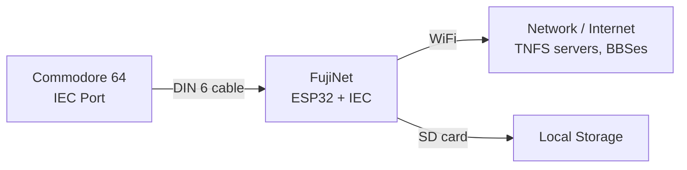

# Commodore 64 Quickstart Guide

Welcome to the FujiNet quickstart guide for the Commodore 64. FujiNet for Commodore (also known as "Meatloaf" / "Fujiloaf") connects via the IEC bus and provides network access, file loading, and more. For a broader overview of all supported platforms, see the [Platform Overview](../platform_overview.md).

> **Beta Notice:** FujiNet for Commodore is currently in active development. Software and hardware features are subject to change. Join the [FujiNet Discord](https://discord.gg/7MfFTvD) for the latest updates.

---

## Hardware Options

FujiNet for Commodore uses the IEC bus, making prototype construction relatively straightforward -- just 6 wires and an ESP32. Several hardware options are available:

### Custom Prototype

You need:
- An **ESP32-WROVER DevKit** board (minimum 8 MB Flash, 8 MB PSRAM) -- the official **ESP32-DEVKITC-VE** from Espressif is recommended
- A **DIN 6 plug** (for the IEC bus connection)
- Wire to connect them

Use the pinout defined in the [generic IEC board configuration](https://github.com/FujiNetWIFI/fujinet-platformio/blob/master/include/pinmap/iec.h#L44).

### LOLIN D32 Pro

The LOLIN D32 Pro ESP32 board includes an onboard Micro-SD card socket and additional hardware that may be enabled in future firmware versions. It is available from AliExpress.

- Load the **Meatloaf-Specialty** firmware for this board
- See the [FujiNet firmware wiki](https://github.com/FujiNetWIFI/fujinet-platformio/wiki) for wiring details

### FujiApple Adapter

If you have a FujiApple Rev0 (FujiNet for Apple II), you can repurpose it for Commodore testing by building an IEC-to-FujiApple adapter cable.

When configuring the firmware build, set: `build_board = fujiapple-iec`

---

## Firmware Installation

Follow the [Board Bring Up Guide](https://github.com/FujiNetWIFI/fujinet-platformio/wiki/Board-Bring-Up-Software) to install PlatformIO and build the Commodore firmware.

---

## Setting Up WiFi

Since there is not yet a fully working on-screen CONFIG for the Commodore, you have two options to configure WiFi:

### Option 1: Edit the SD Card Directly

Remove the SD card from FujiNet, insert it into your computer, and create or edit the `fnconfig.ini` file with your WiFi credentials.

### Option 2: Set WiFi from BASIC

1. Start your Commodore 64 with FujiNet attached to the IEC bus.
2. Switch to upper/lowercase mode by pressing the **Commodore key** + **Shift**.
3. Enter the following command, substituting your network name and password:

```
OPEN1,15,15,"SETSSID:YourSSID,YourPassword":CLOSE1
```

4. Reboot FujiNet. It should connect to your WiFi network.

> **Tip:** If your SSID contains capital letters, the `SETSSID` command must include those capitals. They may display as PETSCII characters on screen, but will be sent correctly.

---

## Connection Diagram



---

## Using FujiNet as a Modem

FujiNet can emulate a modem, letting you connect to BBSes and other telnet services.

### NETCAT

1. Start your Commodore 64 with FujiNet attached.
2. Load NETCAT:

```
LOAD"ML:NETCAT",8
RUN
```

3. In the NETCAT terminal, type a telnet address:

```
telnet://bbs.retroacademy.it:6510
```

### PTERM

PTERM is a more full-featured terminal application available from the Meatloaf file repository:

```
LOAD"ML:PTERM",8
```

---

## Loading and Running Software

FujiNet for Commodore provides two network disk devices:

| Device | Number | Protocol | Description |
|--------|--------|----------|-------------|
| **TNFS** | 12 | TNFS | Standard FujiNet protocol for accessing TNFS servers |
| **Meatloaf (ML)** | 8 | HTTP | Meatloaf-specific HTTP file access |

### Loading via TNFS

TNFS loading works the same as on other FujiNet-supported platforms. Use device number **12**:

```
LOAD"TNFS://APPS.IRATA.ONLINE/PETSCIITERM.PRG",12
RUN
```

More examples:

```
LOAD"TNFS://FUJINET.DILLER.ORG/C64/DIGDUG.PRG",12
RUN
```

> **Warning:** Due to PETSCII character mapping, always **type in uppercase** on the Commodore. The URIs will be converted to lowercase when sent to remote servers. Even if examples here appear in lowercase, type them in uppercase on your Commodore.

### Loading via Meatloaf

Use the `ML:` prefix with device number **8**:

```
LOAD"ML:GAME$",8
LOAD"ML:EMPIRE",8,1
LOAD"ML:DIGDUG",8,1
```

### Custom File Browser (FB64)

The Meatloaf distribution includes a modified version of FB64, a file browser for the Commodore 64/128. It supports navigation and loading of files from both the local SD card and internet-connected Meatloaf file repositories.

```
LOAD"ML:FB64",8
```

---

## Advanced Features

### JSON Parsing

Meatloaf supports parsing JSON data from web APIs, opening up possibilities for retrieving and displaying internet data on your Commodore. Here is an example that fetches and displays a random joke from an API:

```basic
10 REM *** OPEN COMMS
11 OPEN 15,16,15, ""
12 OPEN 2,16,2,"HTTPS://API.CHUCKNORRIS.IO/JOKES/RANDOM"
20 REM *** RECEIVE, PARSE, PRINT DATA
21 PRINT#15, "JSONPARSE,2"
22 PRINT#15, "JQ,2,/VALUE"
23 PRINT#15, "BITEPARSE,2,80"
24 INPUT#2, J$: PRINT J$;
25 IF(ST AND 64)=0 THEN GOTO 24
30 REM *** CLOSE
31 CLOSE 2: CLOSE 15
```

### Running Your Own File Server

You can host your own Meatloaf-compatible file server. All you need is a host that runs PHP. Grab the server script from the [Meatloaf Specialty repository](https://github.com/idolpx/meatloaf-specialty?tab=readme-ov-file#want-to-host-your-own-files-on-a-webserver).

For more information, visit [meatloaf.cc](https://meatloaf.cc).

---

## Further Reading

- [Platform Overview](../platform_overview.md) for a summary of all supported platforms
- [Meatloaf project](https://meatloaf.cc) for Commodore-specific development
- Join the [FujiNet Discord](https://discord.gg/7MfFTvD) community for real-time support and the latest development updates
