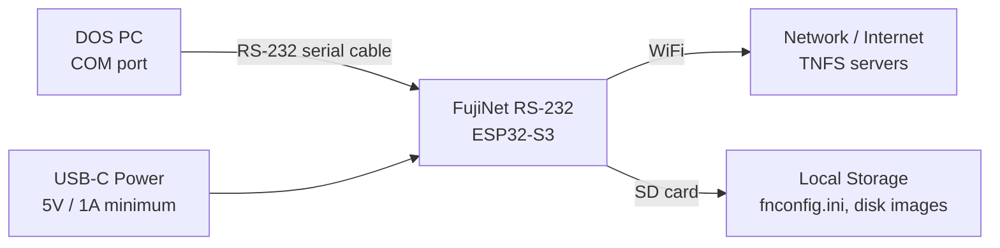
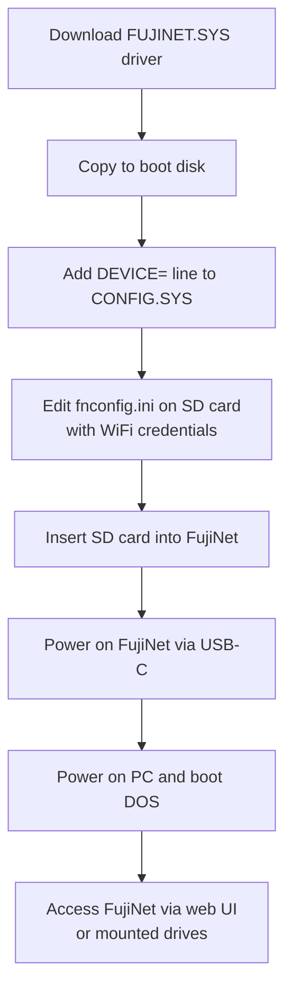

# RS-232 (MS-DOS PC) Quickstart Guide

Welcome to the FujiNet quickstart guide for RS-232 serial connections. FujiNet RS-232 currently targets MS-DOS (PC-compatible) systems via a standard serial port. Support for other serial devices may be added in the future. For a broader overview of all supported platforms, see the [Platform Overview](../platform_overview.md).

> **Beta Notice:** FujiNet RS-232 support is under active development. Some features (notably the on-screen CONFIG application) are not yet fully functional. Join the [FujiNet Discord](https://discord.gg/7MfFTvD) for the latest updates.

---

## Hardware

### Overview

The RS-232 FujiNet uses the newer **ESP32-S3** chipset (rather than the original ESP32 used by other FujiNet variants). The ESP32-S3 provides similar functionality with some beneficial upgrades.

### Connection Diagram



### Power Requirements

FujiNet RS-232 requires a standard **5V USB-C power source** providing at least **1 amp**.

> **Important:** Power on the FujiNet **before** powering on your PC. This ensures FujiNet is ready to respond when DOS loads the driver.

---

## Software Setup

### Installing the DOS Driver

A DOS device driver is required for your PC to communicate with FujiNet.

1. Download the latest driver from the [fujinet-rs232 releases page](https://github.com/FujiNetWIFI/fujinet-rs232/releases). The most recent version will be at the top.
2. Expand the "Assets" section and download the `.sys` file.
3. Rename the file to `FUJINET.SYS`.
4. Copy `FUJINET.SYS` to your system's boot disk or drive.
5. Add the following line to your `CONFIG.SYS`:

```
DEVICE=FUJINET.SYS
```

6. Reboot to load the driver.

### Driver Configuration Options

The driver supports two optional parameters:

| Parameter | Default | Description |
|-----------|---------|-------------|
| `FUJI_PORT` | `1` | COM port number FujiNet is connected to (1, 2, 3, etc.) |
| `FUJI_BPS` | `115200` | Baud rate for serial communication |

Example `CONFIG.SYS` with custom settings:

```
DEVICE=FUJINET.SYS FUJI_BPS=9600 FUJI_PORT=2
```

### Baud Rate Troubleshooting

If your computer hangs when accessing FujiNet-mounted drives, try lowering the baud rate. Test progressively slower speeds until you find one that works reliably:

| Speed | Notes |
|-------|-------|
| 115200 | Default -- fastest, works on most systems |
| 57600 | Try this first if 115200 causes hangs |
| 38400 | Good for older or slower systems |
| 19200 | Conservative speed |
| 9600 | Most compatible, slowest |

> **Important:** If you change the baud rate in `CONFIG.SYS`, you **must** also update the FujiNet's `fnconfig.ini` file on the SD card to match:

```ini
[RS232]
baud=9600
```

---

## Connecting to WiFi

The on-screen CONFIG application is not yet fully functional for RS-232. To configure WiFi, manually edit the `fnconfig.ini` file on the FujiNet's SD card:

1. Remove the SD card from FujiNet.
2. Insert the SD card into your modern computer.
3. Edit (or create) the `fnconfig.ini` file with your WiFi credentials. See the [fnconfig.ini reference](https://github.com/FujiNetWIFI/fujinet-firmware/wiki/Sample-FNCONFIG.INI) for the full format.
4. Insert the SD card back into FujiNet.
5. Power cycle FujiNet.

### Setup Flow



---

## Web User Interface

Once FujiNet is connected to your WiFi network, you can manage it through its built-in web interface:

1. Open a browser on any device connected to the same network.
2. Navigate to `http://fujinet.local` or the IP address assigned to your FujiNet.
3. From the web interface, you can mount disk images, browse TNFS servers, and manage FujiNet settings.

---

## FujiNet-Enabled Applications

Some FujiNet-enabled applications are available for MS-DOS:

- Source code is in the [fujinet-rs232 repository](https://github.com/FujiNetWIFI/fujinet-rs232)
- Apps can be built with the [Open Watcom](http://www.openwatcom.org/) compiler
- Precompiled versions are available on the `apps.irata.online` TNFS server

---

## Further Reading

- [Platform Overview](../platform_overview.md) for a summary of all supported platforms
- [fnconfig.ini reference](https://github.com/FujiNetWIFI/fujinet-firmware/wiki/Sample-FNCONFIG.INI) for configuration file details
- Join the [FujiNet Discord](https://discord.gg/7MfFTvD) community for real-time support
