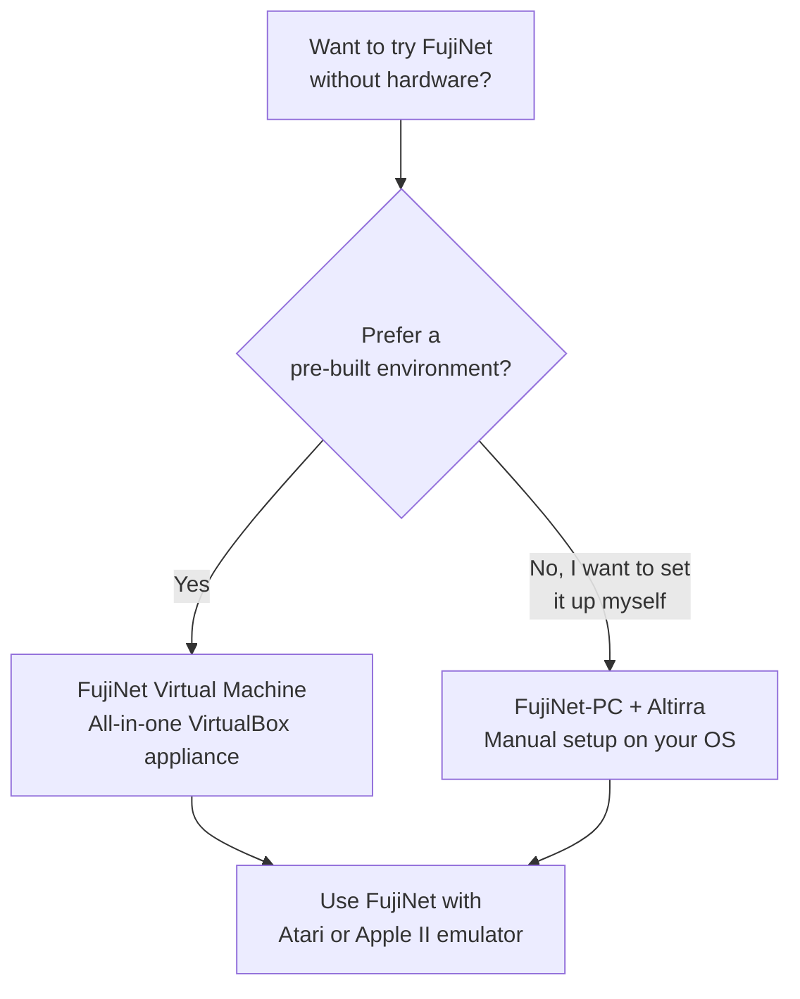
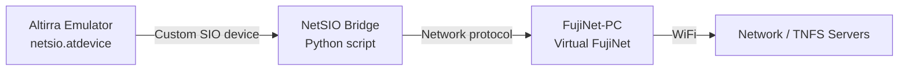

# Virtual FujiNet Quickstart Guide

No retro hardware? No problem. You can experience FujiNet entirely in software using either the pre-built **FujiNet Virtual Machine** or a manual **FujiNet-PC + Emulator** setup on your own computer. This guide covers both approaches. For a broader overview of all supported platforms, see the [Platform Overview](../platform_overview.md).

---

## Choose Your Approach



| Approach | Best For | Requirements |
|----------|----------|-------------|
| **FujiNet Virtual Machine** | Quickest start, everything pre-configured | VirtualBox 6 or 7, ~3.6 GB download |
| **FujiNet-PC + Altirra** | Full control, native performance, multiple instances | Python, Altirra (Windows or Wine), FujiNet-PC binaries |

---

## Option 1: FujiNet Virtual Machine

The [FujiNet Virtual Machine](https://vm.fujinet.online) is a pre-built VirtualBox appliance that includes everything you need to try FujiNet with both Atari and Apple II emulators.

### What Is Included

The VM is a Debian 12 Linux environment with the XFCE 4 desktop, containing:

| Component | Description |
|-----------|-------------|
| **Altirra** | Atari 8-bit emulator (runs via Wine), with desktop launcher |
| **AppleWin** | Apple II emulator (native Linux port), with desktop launcher |
| **FujiNet-PC for Atari** | Virtual FujiNet device with `netsio` bridge (starts automatically) |
| **FujiNet-PC for Apple** | Virtual FujiNet device for AppleWin (starts automatically) |
| **Epiphany browser** | For accessing the virtual FujiNet's web UI |

### Download and Import

1. Download the latest VM build from the [FujiNet VM download page](https://mega.nz/folder/4L03hKRL#L1GOblpv8xbHROaKIPb1xg) (~3.6 GB file).
2. Open **VirtualBox**.
3. From the **File** menu, select **Import Appliance...**.
4. Select the downloaded OVA file and click **Next**.
5. Optionally change the **Machine Base Folder** to your preferred storage location. Other settings can be left at their defaults.
6. Click **Finish** and wait for the import to complete.

### Performance Tip

The VM works without any modifications, but if you have extra RAM available, increasing the VM's allotted memory will make a noticeable performance difference.

### Using the VM

Once the VM boots:

- **Altirra** and **AppleWin** launchers are on the desktop
- FujiNet-PC services start automatically in the background
- Use the **Epiphany** browser to access the FujiNet web UI for configuration
- Everything is pre-connected -- just launch an emulator and FujiNet CONFIG will appear

For more detailed usage instructions, see the [official FujiNet VM documentation](https://fujinet-vm.readthedocs.io/).

---

## Option 2: FujiNet-PC with Altirra (Manual Setup)

For users who want to run FujiNet on their own system without a VM, you can set up FujiNet-PC and connect it to the Altirra Atari emulator. This approach works on Windows, macOS, and Linux.

### Architecture Overview



Altirra communicates through a custom device file (`netsio.atdevice`) to a Python-based NetSIO bridge, which in turn connects to FujiNet-PC.

### Prerequisites

| Component | Source |
|-----------|--------|
| **Python** | [python.org](https://www.python.org/) or [installation guide](https://www.geeksforgeeks.org/how-to-install-python-on-windows/) |
| **Altirra** | [virtualdub.org/altirra.html](https://www.virtualdub.org/altirra.html) (Windows only; use [Wine](https://www.winehq.org/) for macOS/Linux) |
| **NetSIO Bridge** | [fujinet-pc-launcher releases](https://github.com/a8jan/fujinet-pc-launcher/releases) -- download the latest `fujinet-pc-scripts-*` archive |
| **FujiNet-PC** | [FujiNet firmware releases](https://github.com/FujiNetWIFI/fujinet-firmware/releases/) -- download the latest **FujiNet-PC** nightly build |

### Installation Steps

1. Download and unzip the **NetSIO Bridge** scripts.
2. Download the latest **FujiNet-PC** nightly build and unzip it into the `fujinet-pc` directory inside the NetSIO Bridge scripts folder.

Your directory structure should look like:

```
fujinet-pc-scripts/
    netsiohub.py (and other scripts)
    emulator/
        Altirra/
            netsio.atdevice
    fujinet-pc/
        run-fujinet (and FujiNet-PC files)
```

### Configuring Altirra

#### Step 1: Configure Altirra Settings

Open Altirra and configure (or edit the `.ini` configuration file directly):

| Setting | Value | Reason |
|---------|-------|--------|
| Fast boot | Disabled (`0`) | FujiNet CONFIG needs a normal boot sequence |
| Pause when inactive | Disabled (`0`) | Keeps the emulator running in the background |
| Display: Direct3D9 | Disabled (`0`) | Required on macOS via Wine to avoid crashes |
| Display: 3D | Disabled (`0`) | Required on macOS via Wine to avoid crashes |

#### Step 2: Add the FujiNet Bridge Device

In Altirra, add a custom device pointing to the `netsio.atdevice` file in your emulator/Altirra directory. In the configuration `.ini` file, this looks like:

```
"Devices" = "[{\"tag\":\"custom\",\"params\":{\"hotreload\":false,\"path\":\"C:\\path\\to\\netsio.atdevice\"}}]"
```

Replace the path with the actual location of your `netsio.atdevice` file.

### Starting Everything Up

Launch the components in this order:

**1. Start the NetSIO Bridge:**

```bash
cd /path/to/fujinet-pc-scripts/
python3 -m netsiohub --port 9996 --netsio-port 9997
```

**2. Start FujiNet-PC:**

```bash
cd /path/to/fujinet-pc-scripts/fujinet-pc/
./run-fujinet
```

**3. Start Altirra:**

On Windows:
```
Altirra64.exe /portablealt:instance-1.ini
```

On macOS/Linux (via Wine):
```bash
wine64 Altirra64.exe /portablealt:instance-1.ini
```

Altirra should boot into the FujiNet CONFIG screen, just as it would on real hardware.

### Default Port Assignments

| Component | Port |
|-----------|------|
| NetSIO Bridge (Altirra-facing) | 9996 |
| NetSIO Bridge (FujiNet-PC-facing) | 9997 |

---

## Running Multiple Instances

You can run two independent Altirra + FujiNet-PC environments simultaneously to simulate two separate Atari computers on a single machine.

### Instance Port Map

| Instance | Bridge Port (Altirra) | NetSIO Port (FujiNet-PC) |
|----------|----------------------|--------------------------|
| Instance 1 | 9996 | 9997 |
| Instance 2 | 9986 | 9987 |

### Setup for Instance 2

1. **Duplicate the FujiNet-PC directory** to `fujinet-pc2`.
2. **Edit** `fujinet-pc2/fnconfig.ini` to use the second instance ports:

```ini
[NetSIO]
enabled=1
host=localhost
port=9997
```

Change `port` to `9987` for instance 2.

3. **Duplicate** `netsio.atdevice` to `netsio-2.atdevice` and change the port:

```
option "network":
{
    port: 9986
};
```

4. **Duplicate** `instance-1.ini` to `instance-2.ini` and update the device path to reference `netsio-2.atdevice`.

### Launching Both Instances

```bash
# Instance 1
python3 -m netsiohub --port 9996 --netsio-port 9997
./fujinet-pc/run-fujinet
wine64 Altirra64.exe /portablealt:instance-1.ini

# Instance 2 (in separate terminals)
python3 -m netsiohub --port 9986 --netsio-port 9987
./fujinet-pc2/run-fujinet
wine64 Altirra64.exe /portablealt:instance-2.ini
```

Each instance boots into its own independent FujiNet CONFIG, functioning as separate machines.

---

## Further Reading

- [Official FujiNet VM Documentation](https://fujinet-vm.readthedocs.io/) for in-depth VM usage and troubleshooting
- [FujiNet-PC Launcher Repository](https://github.com/a8jan/fujinet-pc-launcher) for the latest NetSIO bridge scripts
- [Platform Overview](../platform_overview.md) for a summary of all supported platforms
- Join the [FujiNet Discord](https://discord.gg/7MfFTvD) community for real-time support
