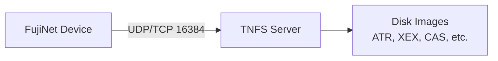

# Setting Up a TNFS Server

TNFS (Trivial Network File System) is one of FujiNet's core features, allowing your retro computer to access disk images hosted on a server over the network. This guide covers setting up your own TNFS server on Linux, Windows, macOS, and Raspberry Pi.

## Overview

The FujiNet project maintains a fork of the TNFSD server originally created for the Spectranet project. TNFS communicates over **UDP port 16384** by default and also supports **TCP on the same port** (firmware 1.3 and later).



**Resources:**

- Pre-compiled binaries: [FujiNet.online Downloads](https://fujinet.online/download/)
- Source code: [github.com/FujiNetWIFI/tnfsd](https://github.com/FujiNetWIFI/tnfsd)

The source repository includes pre-built 64-bit binaries for Linux (`tnfsd`) and Windows (`tnfsd.exe`) in the `tnfs/tnfsd/bin` directory.

---

## Linux (Arch Linux)

An AUR package is available for Arch Linux. Install with:

```shell
yay -S tnfsd
systemctl --user enable --now tnfsd
```

The default shared directory is `$HOME/TNFS`.

### Changing the Shared Directory

Create the file `$HOME/.config/tnfsd/env` with the following content:

```
TNFS_DIR=/path/you/want
```

Then restart the service:

```shell
systemctl --user restart tnfsd
```

---

## Linux (Raspberry Pi and Other Distributions)

### Easy Method

A pre-made Raspberry Pi image is available that automatically sets up a TNFS server. Follow the instructions at:

[atari8bit.net - FujiNet TNFS Server Image](https://atari8bit.net/projects/software/fujinet-tnfs-server-image/)

### Manual Setup

These instructions work for Raspberry Pi OS (Raspbian) and other Debian-based distributions.

#### 1. Initial System Configuration

```shell
sudo raspi-config
```

- Set your hostname
- Set GPU memory to 16MB
- Enable SSH (optional)
- Set locale and timezone
- Configure WiFi if needed

#### 2. Install Dependencies and Build

```shell
sudo apt-get install git samba samba-common-bin
git clone https://github.com/FujiNetWIFI/tnfsd.git
cd tnfsd/src
make OS=LINUX DEBUG=Y
sudo cp ../bin/tnfsd /usr/local/sbin
```

#### 3. Create a TNFS User and Directory

```shell
sudo useradd -m tnfs
sudo mkdir -p /tnfs
sudo chown tnfs:tnfs /tnfs
```

Place your disk images and folders inside `/tnfs`.

#### 4. Create the Systemd Service

Create the file `/etc/systemd/system/tnfsd.service`:

```ini
[Unit]
Description=TNFS Server
After=remote-fs.target
After=syslog.target

[Service]
User=tnfs
Group=tnfs
ExecStart=/usr/local/sbin/tnfsd /tnfs

[Install]
WantedBy=multi-user.target
```

Enable and start the service:

```shell
sudo systemctl daemon-reload
sudo systemctl enable tnfsd
sudo systemctl start tnfsd
```

#### 5. Optional: Set Up Samba for Easy File Management

Add the following to the bottom of `/etc/samba/smb.conf`:

```ini
[tnfs]
        path = /tnfs
        writeable = Yes
        create mask = 0777
        directory mask = 0777
        public = yes
        force user = tnfs
        force group = tnfs
```

Then restart Samba:

```shell
sudo systemctl restart smbd
```

This allows you to copy disk images to the TNFS directory from other computers on your network using Windows file sharing.

---

## Windows 10/11

### Manual Setup

#### 1. Download the Server

Download the pre-compiled `tnfsd.exe` from the [FujiNet Downloads page](https://fujinet.online/download/).

#### 2. Create Directories

- Create `C:\tnfsd` and place `tnfsd.exe` in it.
- Create `C:\tnfsroot` and put your disk images and subfolders here.

#### 3. Configure the Firewall

1. Open **Start** and search for "Firewall".
2. Click **Allow an app through firewall**.
3. Click **Change settings**, then **Allow another app...**.
4. Browse to `C:\tnfsd\tnfsd.exe` and add it.
5. Check both **Private** and **Public** checkboxes.

#### 4. Set Up Automatic Startup

1. Open **Computer Management** (right-click Start).
2. Open **Task Scheduler** and click **Create a Basic Task**.
3. Name it `TNFSD`.
4. Set trigger to **When the computer starts**.
5. Set action to **Start a program**.
6. Browse to `C:\tnfsd\tnfsd.exe` with argument `C:\tnfsroot`.
7. Check **Open the Properties dialog** when finished.
8. In properties, select **Run whether user is logged on or not** and **Run with highest privileges**.
9. Reboot.

#### 5. Security Hardening

Once verified working, create a dedicated user with read-only access to `C:\tnfsroot`. Update the scheduled task to run as that user and uncheck **Run with highest privileges**.

### Using Tnfsd.NET (Simplified Setup)

[Tnfsd.NET](https://github.com/RichStephens/Tnfsd.NET/releases/latest) is a utility that simplifies TNFS server management on Windows. It provides:

- Automatic download and installation of the latest `tnfsd.exe`
- GUI for selecting the shared folder
- One-click creation of a Windows Task Scheduler task
- Optional automatic firewall configuration
- System tray icon for start/stop control and status monitoring

**Requirements:** [.NET 8.0 Runtime](https://dotnet.microsoft.com/en-us/download/dotnet/8.0)

Download the executable and `appsettings.json` from the [Tnfsd.NET releases page](https://github.com/RichStephens/Tnfsd.NET/releases/latest) and run it.

---

## macOS

### 1. Download the Server

Download the correct pre-compiled binary for your Mac (Intel or Apple Silicon) from the [FujiNet Downloads page](https://fujinet.online/download/).

To build from source instead, install the Xcode command-line tools and run:

```shell
cd tnfsd
make OS=BSD
```

### 2. Install the Binary

Copy the tnfsd binary to a suitable location:

```shell
sudo mkdir -p /opt/local
sudo cp tnfsd /opt/local/
```

### 3. Create a Shared Directory

Create a directory for your disk images. For example:

```shell
mkdir -p ~/tnfsroot
```

You can use any existing folder that contains your Atari disk images. Avoid spaces in the path if possible.

### 4. Set Up Automatic Startup

Create a LaunchAgent plist file at `~/Library/LaunchAgents/com.fujinet.tnfsd.plist`:

```xml
<?xml version="1.0" encoding="UTF-8"?>
<!DOCTYPE plist PUBLIC "-//Apple//DTD PLIST 1.0//EN"
  "http://www.apple.com/DTDs/PropertyList-1.0.dtd">
<plist version="1.0">
    <dict>
        <key>Label</key>
        <string>com.fujinet.tnfsd</string>
        <key>ProgramArguments</key>
        <array>
            <string>/opt/local/tnfsd</string>
            <string>/Users/yourusername/tnfsroot</string>
        </array>
        <key>RunAtLoad</key>
        <true/>
    </dict>
</plist>
```

Replace `/Users/yourusername/tnfsroot` with the full path to your disk image directory. Do not use shortcuts like `~/`.

> **Important:** Do not use TextEdit to create this file, as it may save in RTF format. Use a plain text editor such as `vi`, `nano`, or [BBEdit](https://www.barebones.com).

### 5. Verify the Server

Reboot your Mac, then open **Activity Monitor** and search for `tnfsd` to confirm it is running.

### Preventing Sleep

If your Mac goes to sleep, FujiNet will lose access to the TNFS server. To disable sleep:

```shell
sudo pmset -a disablesleep 1
```

### LaunchAgent Location

- `~/Library/LaunchAgents/` -- runs when your user account logs in.
- `/Library/LaunchAgents/` -- runs regardless of which user is logged in.

Your Mac may prompt you to allow tnfsd access to the shared folder on first use from FujiNet. Be ready to approve this on the Mac.

---

## Allowing Public Internet Access

To make your TNFS server accessible from the internet:

1. **Port Forwarding:** On your router, forward **UDP port 16384** (and optionally **TCP port 16384**) to the local IP address of your TNFS server.
2. **Domain or IP:** Use a domain name pointed to your external IP, or use a dynamic DNS service. You can find your external IP at [whatismyipaddress.com](https://whatismyipaddress.com/).
3. **Test externally:** Have someone with a FujiNet on a different network enter your domain name or external IP into a host slot and verify they can browse your files.

---

## TCP Support

As of firmware version 1.3, FujiNet supports TCP connections to TNFS servers in addition to UDP. The behavior is:

- FujiNet **automatically attempts TCP first**, then falls back to UDP if TCP is unavailable.
- The latest version of tnfsd supports both TCP and UDP on port 16384.
- To **force TCP** (disabling UDP fallback), prefix the hostname with `_tcp.`:
  ```
  _tcp.192.168.1.12
  ```
  This is rarely needed and is mainly useful for verifying that TCP is in use.

You can confirm which protocol is being used by watching the tnfsd server log output, which records every new TCP connection.

### TNFS Python Client

A Python TNFS client is available for testing and debugging:

```shell
python3 tnfs_client3.py tnfs.fujinet.online
```

The client auto-detects TCP/UDP and supports `--tcp` and `--udp` switches to force a specific protocol. Source code is available at: [github.com/FujiNetWIFI/spectranet-tnfs-fuse](https://github.com/FujiNetWIFI/spectranet-tnfs-fuse)

---

## Public TNFS Servers

If you want to use existing public servers instead of running your own, see the host slot examples in the [CONFIG User Guide](../config/overview.md).
