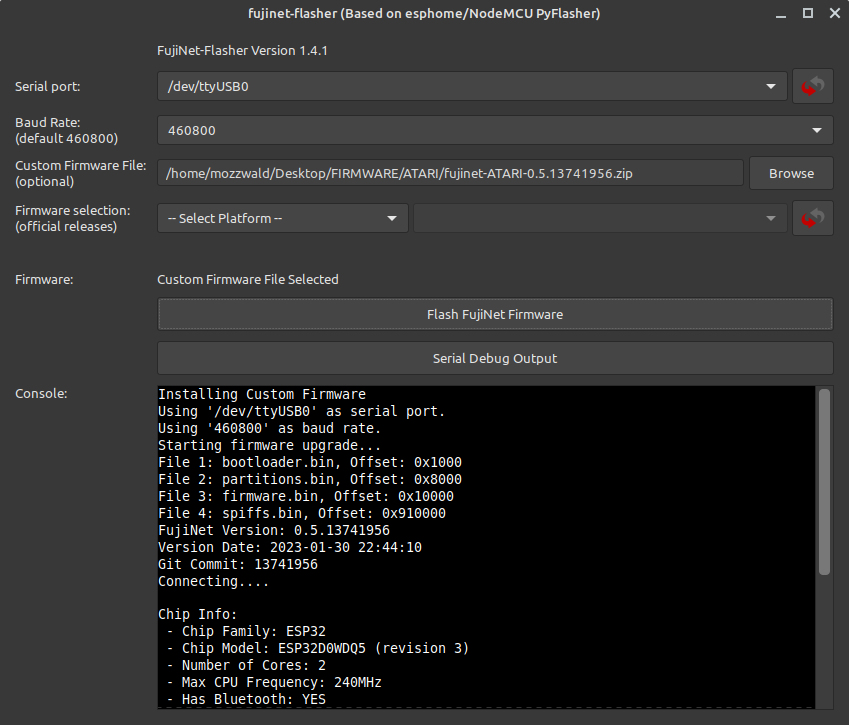

# FujiNet Flasher

## Table of Contents

* [Overview](#overview)
* [How to find out when a new firmware version is available?](#how-to-find-out-when-a-new-firmware-version-is-available?)
* [Install the USB Driver](#install-the-usb-driver)
* [Installing Firmware with FujiNet Flasher](#installing-firmware-with-fujinet-flasher)
* [Capturing Serial Debug Output](#capturing-serial-debug-output)
* [Tips for flashing problems](#tips-for-flashing-problems)
* [Flashing a custom firmware file](#flashing-a-custom-firmware-file)
* [Creating a custom firmware file](#creating-a-custom-firmware-file)
* [App and Code Signing the Macintosh Flasher](#app-and-code-signing-the-Macintosh-flasher)

## Overview

Occasionally, new versions of the FujiNet firmware (the software that runs _on_ the FujiNet device itself) are released.  The main FujiNet website has a page dedicated to the FujiNet Flasher tool, located here: https://fujinet.online/download/

## How to find out when a new firmware version is available?

* Run the FujiNet-Flasher, select your Platform, select the version at the top of the list and compare the version information displayed to what you have installed on your FujiNet device
* mozzwald's [FujiNet Firmware Update Information thread at AtariAge](https://atariage.com/forums/topic/313303-fujinet-firmware-update-information/) for ATARI
* Maybe also the [FujiNet User's Group on Facebook](https://www.facebook.com/groups/fujinetusers/about/)
* Follow some key FujiNet developers on Twitter
  * [Thomas Cherryhomes (@tschak)](https://twitter.com/tschak)
  * [@mozzwald](https://twitter.com/mozzwald)

## Install the USB Driver

Some computers may not detect the FujiNet when it is plugged in. You may need to install the USB to UART driver from [Silicon Labs](https://www.silabs.com/products/development-tools/software/usb-to-uart-bridge-vcp-drivers) (manufacturer of the chip used in Fujinet). Download and install the appropriate driver for your system.

## Installing Firmware with FujiNet Flasher

The FujiNet Flasher tool will download the latest firmware, and upload it to your #FujiNet device.

>[!important]
>The flash tool only supports FujiNet hardware with 8MB PSRAM and 16MB flash for ATARI. Coleco ADAM FujiNet has support for 8MB and 16MB flash.

### Windows
Run with administrator privileges

### macOS
(Details needed.)

### Linux
Run as root, e.g. `sudo ./FujiNet-Flasher`. Alternatively, add your 'regular' user to the appropriate 'group' on your system. For example, if your #FujiNet, via micro-USB cable, appears on your system as the device `/dev/ttyUSB0`, check which group the device is part of.

```sh
ls -l /dev/ttyUSB0
crw-rw---- 1 root dialout 188, 0 Nov 14 11:10 /dev/ttyUSB0
```

Then, add your account to that group (in the example above, "`dialout`"):

```sh
sudo usermod -a -G dialout USERNAME
```

To access it immediately (no need to log out and back in) just run, e.g., `newgrp dialout`.

Now, you should be able to run `./FujiNet-Flasher` without switching to `root` user, or running it under `sudo`.

## Capturing Serial Debug Output

Debugging info from FujiNet can be captured using Fujinet-Flasher. This info may be requested by developers to aid in fixing bugs or troubleshooting hardware problems. These are the steps to capture this information:

* Connect FujiNet to a computer with a MicroUSB cable
* Run Fujinet-Flasher and select the the correct port used by Fujinet (ie, *COM3* on Windows, */dev/ttyUSB0* on linux)
* Click the Serial Debug Output button in Fujinet-Flasher
* Press the RESET button on the FujiNet device (Button C, far right)
* Debug information will appear in the Fujinet-Flasher window
* Reproduce your problem with FujiNet then select all (CTRL-A) text in the box and copy it (CTRL-C)
* Paste the debug output to the developer requesting this information
  * If using AtariAge forum, paste the information into a Spoiler box so the debug output does not fill up the thread
  * Optionally, use a paste site such as our [FujiNet PrivateBin](https://paste.fujinet.online/) and provide the URL

## Tips for flashing problems

Some people have issues where the flasher just shows `Connecting...---...` or similar when trying to flash the FujiNet. Sometimes this can be caused by a poor quality USB cable and can be fixed by trying another. If the problem persists, you can also force the FujiNet into flashing mode by pressing and holding down the `A Button` during the entire flashing process. (More info about the flashing issue in [this "espressif/esptool" bug report comment](https://github.com/espressif/esptool/issues/293#issuecomment-581114110).)

A user has provided this process for Windows users having issues. The issue appears to be that some other app or program takes control of the serial port if you wait too long:

1. Run FujiNet-Flasher
1. Select your platform
1. Select firmware version
1. Turn on or plugin the FujiNet and quickly hit the Flash Firmware button

## Flashing a custom firmware file
Sometimes the FujiNet development team may provide a custom firmware file (ZIP) to an end user for testing. This file can be flashed with FujiNet-Flasher. Previously, one had to run the flasher from the command line (`FujiNet-Flasher /path/to/firmware.zip`) to use a custom firmware file. The latest version has an option in the interface to select a local firmware file to flash.

Download the latest version at [Fujinet Home](https://fujinet.online/download/)



## Creating a custom firmware file

A new script has been added to the fujinet-platformio repo that can be enabled in `platformio.ini` which will build a flashable firmware ZIP file. First, you must uncomment the post build script below (remove the semicolon at the beginning of the line):

```ini
extra_scripts =
    pre:build_packages.py
    pre:build_version.py
    pre:build_webui.py
    ;post:build_firmwarezip.py ; Optional, build firmware ZIP file for flash tool
```

You can also optionally have the script rename the firmware file. By default the name is based on platform (your chosen hardware platform) and version number (from `include/version.h`). To change the name, uncomment the line below in `platformio.ini` and modify it to your needs:


```ini
; Override platform name when creating firmware ZIP file
; ex: fujinet-CUSTOMNAME-v1.0.zip
;platform_name = CUSTOMNAME
```

After saving the settings to `platformio.ini`, you must first run the Project Tasks `Build Filesystem Image` and then `Build` the firmware. If the build is successful, you will see a new `firmware` dir in the `fujinet-platformio` repo dir that contains the flashable ZIP file.

> [!NOTE]
> ### Manual Firmware File Creation
> Some users may wish to build their own firmware file for distribution (ie, custom hardware builds, special unsupported features, etc).
>
> 1. Create a new directory for the firmware files to reside and edit a new text file named `release.json` in that directory.
> 1. Edit the `release.json` file accordingly for your target board. For an 8MB variant board:
> 
>    ```json
>    {
>      "version": "NEW VERSION NUMBER",
>      "version_date": "VERSION DATE/TIME, format: 2023-01-01 12:59:59",
>      "build_date": "BUILD DATE/TIME, format: 2023-01-01 12:59:59",
>      "description": "NOTES AND DESCRIPTION OF THE CHANGES",
>      "git_commit": "GIT COMMIT HASH",
>      "files": [
>        {
>          "filename": "bootloader.bin",
>          "offset": "0x1000"
>        },
>        {
>          "filename": "partitions.bin",
>          "offset": "0x8000"
>        },
>        {
>          "filename": "firmware.bin",
>          "offset": "0x10000"
>        },
>        {
>          "filename": "spiffs.bin",
>          "offset": "0x600000"
>        }
>      ]
>    }
>    ```
> 
>    For a 16MB variant board:
> 
>    ```json
>    {
>      "version": "NEW VERSION NUMBER",
>      "version_date": "VERSION DATE/TIME, format: 2023-01-01 12:59:59",
>      "build_date": "BUILD DATE/TIME, format: 2023-01-01 12:59:59",
>      "description": "NOTES AND DESCRIPTION OF THE CHANGES",
>      "git_commit": "GIT COMMIT HASH",
>      "files": [
>        {
>          "filename": "bootloader.bin",
>          "offset": "0x1000"
>        },
>        {
>          "filename": "partitions.bin",
>          "offset": "0x8000"
>        },
>        {
>          "filename": "firmware.bin",
>          "offset": "0x10000"
>        },
>        {
>          "filename": "spiffs.bin",
>          "offset": "0x910000"
>        }
>      ]
>    }
>    ```
> 1. Using [PlatformIO and VSCode](https://github.com/FujiNetWIFI/fujinet-platformio/wiki/Board-Bring-Up-Software), build the Firmware and Filesystem images
> 1. Copy the firmware files (`bootloader.bin`, `partitions.bin`, `firmware.bin` and `spiffs.bin`) from `fujinet-platformio/.pio/build/(target-platform)/` to the same directory with `release.json`
> 1. Compress the files into the root of a ZIP file (not in a subfolder) and provide it to the end user


## App and Code Signing the Macintosh Flasher

In order to not have a modern Mac (OSX) refuse to allow you to run the Flasher.app when you first download and run it- it should be code signed and app notorized with Apple. This requires a paid apple Dev account.

Andy Diller has one and has signed the 10.5 release. Below are directions if anyone in the future or present would like to sign their own build for some reason. You would have already setup your Dev account, made a Team, created an app and app password.

### Step 1

Get the Build Flasher.zip from Mozzwald. This is aleady in the right structure to sign and then zip back up. The commands below assume you have taken the zip from Moz and simply unzipped it into it's own directory. Remove the original zip file as you will creating a new one.

### Step 2

Follow the below commands. They should make some sense if you know what you are doing. If they do not make sense then ask a friend or use one that is already signed.

#### Commands

```sh
export SIGN_ID="Developer ID Application: YOUR NAME (YOUR ID)"
export APP_PATH="/Users/sjobs/flasher-sign/15/FujiNet-Flasher.app"

codesign --force --timestamp --options runtime --sign "$SIGN_ID" "$APP_PATH/Contents/MacOS/FujiNet-Flasher"
codesign --force --deep --options runtime --timestamp --sign "$SIGN_ID" "$APP_PATH"
codesign --verify --deep --strict --verbose=2 "$APP_PATH"

ditto -c -k --keepParent FujiNet-Flasher.app FujiNet-Flasher_v1.5.0_macos-10.15.zip

xcrun notarytool submit FujiNet-Flasher_v1.5.0_macos-10.15.zip \
  --apple-id "YOUR_ID" \
  --team-id "YOUR_TEAM_ID" \
  --password "APP_PW_YOU_CREATED_FOR_TEAM" \
  --wait

xcrun stapler staple "$APP_PATH"

spctl --assess --type exec --verbose=4 "$APP_PATH"

```

You are done. You can take that new ZIP and it should install on other's Mac's without requiring them to go into Pref/Security and "Run Anyway" etc. etc. etc...

