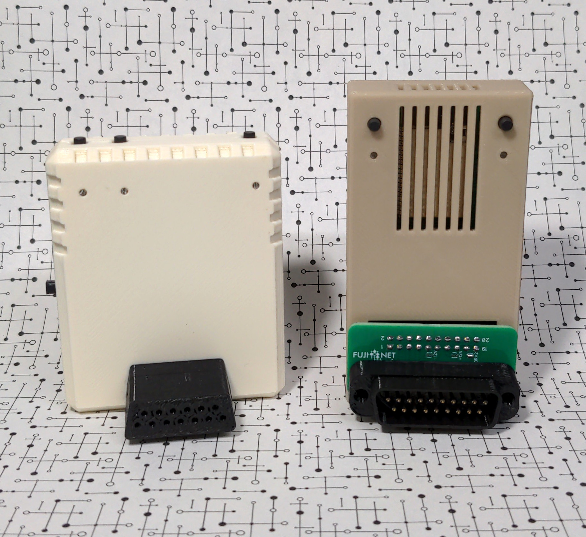

# What is FujiNet?

FujiNet is an hardware device for older computer systems that do not have native solutions for participating on the modern Internet in order to load and manipulate software images and data for native applications. Its simplest use-case-- it can load disk images for the supported platform from remote resources via local WiFi-- it replaces actual floppy drives. It can also replace physical printers and modems. It can offload complex modern Internet protocols from the target platform (like HTTPS and JSON parsing) to allow local apps to treat network resources like native physical devices. It can also be used without networking to load disk images from its microSD card slot.

