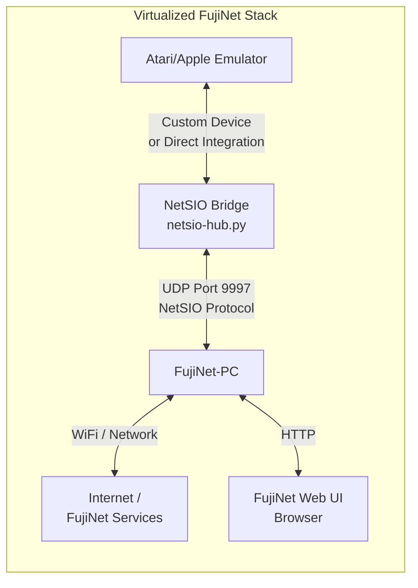
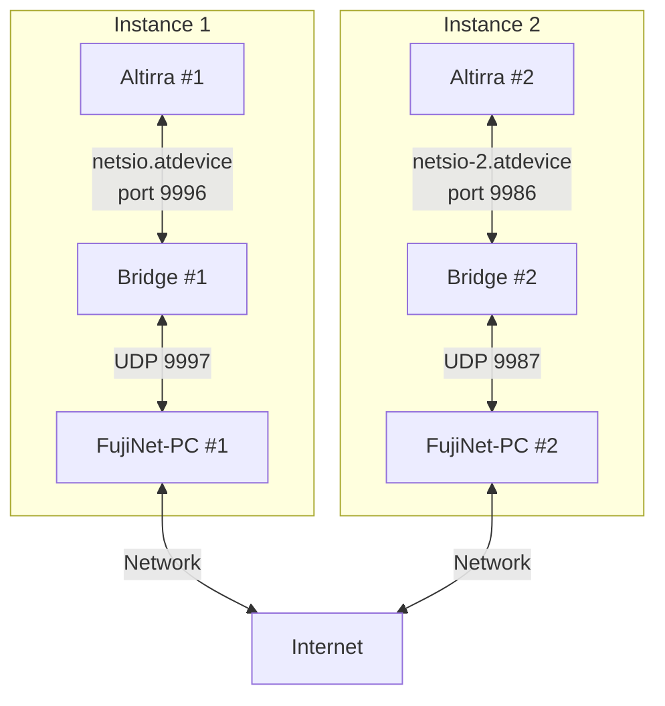

# Using FujiNet with Emulators

FujiNet can be used without any physical retro hardware by running it alongside emulators on modern computers. This page covers FujiNet-PC, the Altirra NetSIO bridge for Atari emulation, the FujiNet VirtualBox VM, and AppleWin integration for Apple II emulation.

## Overview



| Component | Purpose |
|-----------|---------|
| **FujiNet-PC** | Software implementation of FujiNet firmware running on a desktop/laptop |
| **NetSIO Bridge** | Python script that translates between emulator messages and NetSIO UDP datagrams |
| **Emulator** | Atari or Apple II emulator with FujiNet device support |
| **Web UI** | Browser-based configuration interface for the virtual FujiNet |

## FujiNet-PC

FujiNet-PC is a software build of the FujiNet firmware that runs natively on Windows, macOS, and Linux. It replaces the ESP32 hardware with a standard computer while providing the same functionality: disk/cassette/printer emulation, network access, and the web configuration interface.

### Downloads

- **FujiNet-PC nightly builds:** [GitHub Releases](https://github.com/FujiNetWIFI/fujinet-firmware/releases/) (download the FujiNet-PC variant)
- **NetSIO bridge scripts:** [fujinet-pc-launcher](https://github.com/a8jan/fujinet-pc-launcher/releases)

## Altirra + NetSIO Bridge (Atari)

The primary method for using FujiNet with Atari emulation is to connect the Altirra emulator to FujiNet-PC via the NetSIO bridge.

### Data Flow


Altirra uses a custom device file (`netsio.atdevice`) to communicate with the Python NetSIO bridge, which translates messages into NetSIO UDP datagrams for FujiNet-PC.

### Requirements

| Dependency | Notes |
|------------|-------|
| Python 3 | Required for the NetSIO bridge |
| Altirra | Windows-only; use Wine on macOS/Linux |
| Wine (macOS/Linux only) | [winehq.org](https://www.winehq.org/) |

### Downloads

1. **Altirra** -- [virtualdub.org/altirra.html](https://www.virtualdub.org/altirra.html)
2. **NetSIO Bridge** -- [fujinet-pc-launcher releases](https://github.com/a8jan/fujinet-pc-launcher/releases) (download and unzip the `fujinet-pc-scripts-*` archive)
3. **FujiNet-PC** -- [firmware releases](https://github.com/FujiNetWIFI/fujinet-firmware/releases/) (download the FujiNet-PC nightly build and extract to the `fujinet-pc` directory from step 2)

### Setup

#### Altirra Configuration

Configure Altirra for use with FujiNet:

- **Disable fast boot** so the FujiNet CONFIG program will boot:
  ```
  "Kernel: Fast boot enabled" = 0
  ```
- **Enable background execution** so emulation continues when the window loses focus:
  ```
  "Pause when inactive" = 0
  ```
- **macOS only** -- disable Direct3D to avoid crashes under Wine:
  ```
  "Display: Direct3D9" = 0
  "Display: 3D" = 0
  ```
- **Add the FujiNet device** by pointing to the `netsio.atdevice` file in the Altirra custom devices configuration

#### Starting the Stack

1. **Start the NetSIO bridge:**
   ```bash
   cd fujinet-pc-scripts/
   python3 -m netsiohub --port 9996 --netsio-port 9997
   ```

2. **Start FujiNet-PC:**
   ```bash
   cd fujinet-pc-scripts/fujinet-pc/
   ./run-fujinet
   ```

3. **Start Altirra:**
   ```bash
   # Windows
   Altirra64.exe /portablealt:instance-1.ini

   # macOS/Linux with Wine
   wine64 Altirra64.exe /portablealt:instance-1.ini
   ```

Altirra should boot into the FujiNet CONFIG screen.

### Running Multiple Instances

It is possible to run two independent Altirra + FujiNet-PC instances on a single computer, simulating two separate Atari machines (useful for testing multiplayer games).

#### Port Configuration

| Instance | Bridge Port | NetSIO Port |
|----------|-------------|-------------|
| Instance 1 | 9996 | 9997 |
| Instance 2 | 9986 | 9987 |



#### Setup Steps

1. **Duplicate the fujinet-pc directory** to `fujinet-pc2`
2. **Edit `fujinet-pc2/fnconfig.ini`** -- change the NetSIO port to `9987`:
   ```ini
   [NetSIO]
   enabled=1
   host=localhost
   port=9987
   ```
3. **Duplicate `netsio.atdevice`** to `netsio-2.atdevice` and change the port to `9986`:
   ```
   option "network":
   {
       port: 9986
   };
   ```
4. **Create two Altirra configurations** (`instance-1.ini` and `instance-2.ini`), each pointing to its respective `.atdevice` file
5. **Launch all components:**
   ```bash
   # Bridges
   python3 -m netsiohub --port 9996 --netsio-port 9997
   python3 -m netsiohub --port 9986 --netsio-port 9987

   # FujiNet-PC instances
   cd fujinet-pc-scripts/fujinet-pc/ && ./run-fujinet
   cd fujinet-pc-scripts/fujinet-pc2/ && ./run-fujinet

   # Altirra instances
   wine64 Altirra64.exe /portablealt:instance-1.ini
   wine64 Altirra64.exe /portablealt:instance-2.ini
   ```

## FujiNet Virtual Machine (VirtualBox)

The [FujiNet VM](https://vm.fujinet.online) is a pre-configured VirtualBox appliance that bundles everything needed to try FujiNet without purchasing any hardware.

### VM Contents

| Component | Description |
|-----------|-------------|
| Operating System | Debian 12 Linux with XFCE 4 desktop |
| Altirra | Atari emulator, installed and run via Wine (desktop launcher) |
| AppleWin | Apple II emulator, native Linux port (desktop launcher) |
| FujiNet-PC (Atari) | With NetSIO bridge, starts automatically |
| FujiNet-PC (Apple) | For AppleWin integration, starts automatically |
| Epiphany | Web browser for accessing the FujiNet web UI |

### Download and Import

1. **Download** the latest VM build (~3.6 GB): [FujiNet VM on MEGA](https://mega.nz/folder/4L03hKRL#L1GOblpv8xbHROaKIPb1xg)
2. **Import** into VirtualBox (version 6 or 7):
   - From the **File** menu, select **Import Appliance...**
   - Select the downloaded OVA file and click **Next**
   - Optionally change the **Machine Base Folder** to your preferred storage location
   - Click **Finish** and wait for the import to complete

### Performance Tips

- Increase the VM's allotted RAM as much as possible for noticeably better performance
- The VM works without any configuration changes after import
- All other VirtualBox settings can be customized to your preference

### Additional Documentation

Detailed VM usage documentation is available at: [fujinet-vm.readthedocs.io](https://fujinet-vm.readthedocs.io/)

## AppleWin Integration (Apple II)

The FujiNet VM includes AppleWin (the native Linux port) pre-configured to connect to a virtual FujiNet-PC instance for Apple II emulation. FujiNet-PC for Apple starts automatically when the VM boots, and AppleWin can be launched from the desktop shortcut.

For standalone AppleWin + FujiNet-PC setup outside the VM, the process mirrors the Altirra setup: run FujiNet-PC configured for Apple II, then launch AppleWin with the appropriate FujiNet device configuration.

## NetSIO Protocol Details

For the full technical specification of the NetSIO protocol used between the bridge and FujiNet-PC, see [FEP 003: NetSIO Protocol](../internals/feps/fep_003.md).

## See Also

- [FEP 003: NetSIO Protocol](../internals/feps/fep_003.md) -- Full protocol specification
- [FEP 004: FujiNet Protocol](../internals/feps/fep_004.md) -- Universal FujiNet packet format
- [ESP32 Platform Details](../hardware/esp32.md) -- Hardware used in physical FujiNet devices
- [Official Hardware Versions](../hardware/official_versions.md) -- Physical FujiNet hardware revisions
